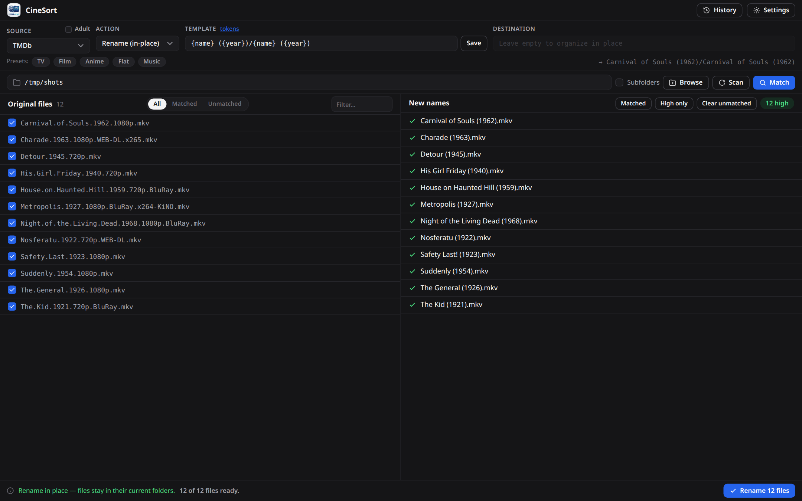
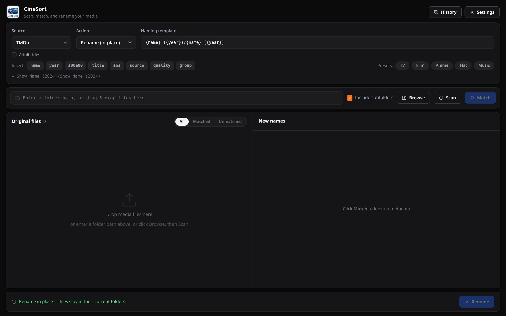
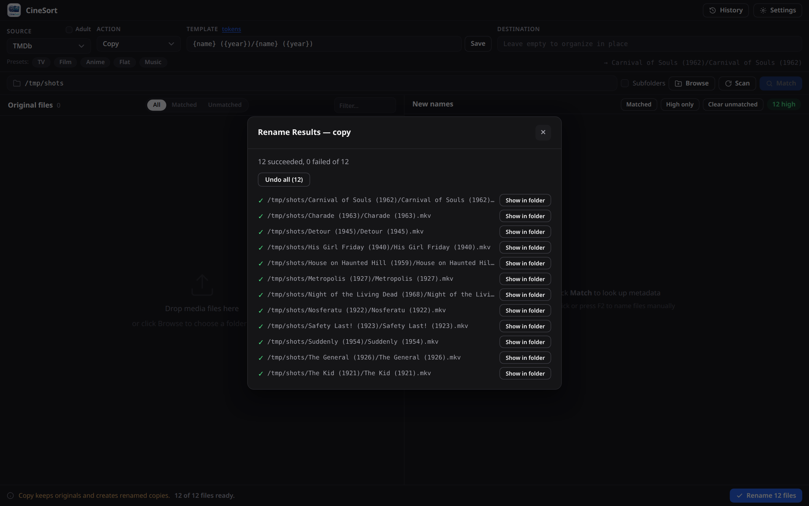
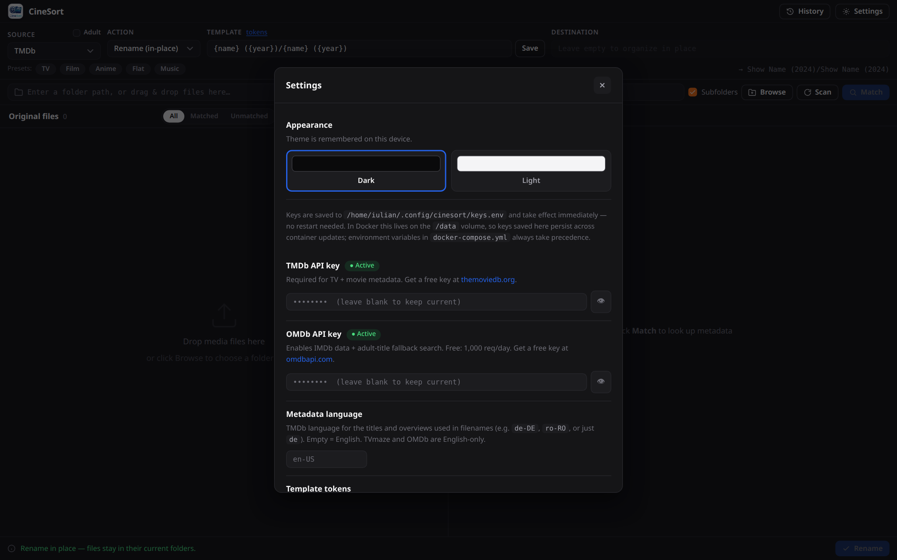

# CineSort

**Professional media file organizer with intelligent metadata matching**

CineSort automatically detects, matches, and renames your movies, TV shows, and music using metadata from TMDb, TVMaze, OMDb (IMDb), and MusicBrainz. Run it as a lightweight Docker container **or** install it as a native desktop app (`.deb` / `.rpm` / AppImage) with a modern web interface.


---

## Screenshots

**Scan, match, and review** — original files on the left, clean new names with per-file selection and confidence on the right:



**Landing page** — source, action, and naming template with live preview and one-click presets:



**Rename results** — every operation is confirmed and undoable from History:



**Settings** — API keys (stored masked), metadata language, dark and light themes:



*The example files shown are public-domain films. Metadata in the match view comes from the TMDb API.*

---

## Features

### Core
- **Smart Detection** — Automatically detects movies and TV shows from filenames (season, episode, year, quality tags, release group)
- **Multi-Source Metadata** — TMDb, TVMaze, and OMDb (IMDb), merged and ranked by confidence
- **Flexible Renaming** — Template-based naming with a token palette and **live preview**, including flat in-place mode
- **Rename In-Place** — Rename files without moving them — works on NAS/SMB shares
- **Multiple Actions** — Rename, Move, Copy, Hard Link, Symlink, Dry-run (Test)

### Matching
- **Cascade scoring + breakdown** — Multi-metric confidence score (name, year, S×E, absolute) with `original_title` awareness; the **View metadata** dialog shows *why* a match was chosen
- **Confidence gate** — High / Review / Low tiers; matches below 40% are flagged **review** and are **not** auto-selected for renaming, so a weak guess can never rename a file by accident
- **Smart fallback search** — Retries with the year dropped, then progressively trimmed titles, so noisy filenames still match
- **Anime / absolute numbering** — Cumulative absolute episode numbers are computed and matched
- **Year disambiguation** — Auto-resolves same-named shows when the filename carries a year (skips an unnecessary prompt)
- **Adult-title support** — Optional Adult toggle unlocks TMDB results filtered by default; OMDb never filters
- **Manual rename** — FileBot-style inline edit when auto-match fails: double-click, F2, or right-click → Edit

### UI / UX
- **Modern flat UI, two themes** — **Dark** (default) and **Light**; switch in Settings → Appearance, remembered per device
- **Folder picker** — Native OS file/folder picker on desktop (reaches your whole filesystem); a rich in-app browser on Docker/web with a shortcuts sidebar, editable path + breadcrumb, type-ahead filter, "media only" toggle, cross-folder multi-select, and full keyboard navigation
- **Template builder** — Insert `{tokens}` from a palette and see a live preview of the resulting path
- **Bulk selection** — One-click "Matched", "≥60%", and "Clear unmatched"
- **Inline conflict resolution** — Resolve duplicate/exists conflicts in place with **Skip** or **Rename → (2)**
- **Drag & Drop** — Drop files or folders anywhere onto the app window (deb/AppImage, Wayland-aware)
- **Start over** — Click the CineSort logo to clear the session and begin fresh
- **Row reordering** — Drag rows to manually remap files to matches
- **Per-file Removal** — DEL key or right-click → Remove
- **Show in folder** — Reveal the original file in your file manager (desktop)
- **Remembers your setup** — Source, action, template, and last folder persist between sessions
- **Rename History** — Full log with per-operation undo; native confirm dialogs replaced with themed ones
- **Accessible** — ARIA roles + visible keyboard focus rings on lists and controls
- **Settings Panel** — Enter API keys in-app; no terminal required for desktop installs

### Platform & reliability
- **Docker Native** — ~180 MB image, runs anywhere
- **Desktop App** — `.deb`, `.rpm`, and AppImage packages for Linux, x86_64 **and** arm64 (Electron shell)
- **Install updates without a terminal** — Double-clicking a downloaded package often dead-ends in the distro's app store ("Installed", no upgrade offered) — so CineSort installs it for you. After **Download update** (verified: size + sha256, GitHub hosts only), the button becomes **Install update**: deb/rpm are installed through your system's native authorization dialog (polkit) — you approve with your password, `apt`/`dnf` do the actual install; AppImages are replaced in place, no privileges needed. Then the familiar **Restart to finish** prompt completes the switch. Nothing ever installs without your explicit click + authorization.
- **Conflict-free launch** — Picks a free port automatically, so a stale/duplicate instance can never block startup
- **Reliable rendering on Linux** — Software compositing avoids the all-black-window issue seen on Wayland/Intel (override with `CINESORT_ENABLE_GPU=1`)
- **Always-fresh UI** — Static assets sent with `Cache-Control: no-cache`, so a rebuilt container never serves stale JavaScript
- **No launcher collisions** — The AppImage won't shadow a deb install's menu entry, and stages itself to a stable path
- **Secure** — Non-root container, 0600 key file, contextIsolation, no eval
- **NAS/SMB Ready** — Actionable error messages for network mount limitations

---

## Quick Start

### Docker (recommended for servers / NAS)

```bash
mkdir -p ~/cinesort && cd ~/cinesort
wget https://raw.githubusercontent.com/aiulian25/cinesort/main/docker-compose.yml
nano docker-compose.yml # Set your media paths and optional API keys
docker compose up -d
```

Open **http://localhost:8888** in your browser.

> **Multi-arch image — just pull, never build.** `aiulian25/cinesort:latest` is published as a multi-arch manifest covering **`linux/amd64`** and **`linux/arm64`**, so it runs out-of-the-box on x86 PCs/mini-PCs/servers **and** ARM devices (Synology DSM 7+, Raspberry Pi 4/5, Apple-silicon Docker). Docker automatically pulls the right architecture — no `--platform` flag and no local build required.

### Desktop (deb / rpm / AppImage — x86_64 and arm64)

Download the latest release from the [Releases page](https://github.com/aiulian25/cinesort/releases).
Every format ships for both **x86_64** (`amd64`/`x86_64`) and **arm64** (`arm64`/`aarch64` — Raspberry Pi 5, ARM laptops).

**Debian / Ubuntu:**
```bash
sudo dpkg -i cinesort_1.3.6_amd64.deb # arm64: cinesort_1.3.6_arm64.deb
cinesort # or launch from your application menu
```

**Fedora / RHEL / openSUSE:**
```bash
sudo dnf install ./cinesort-1.3.6.x86_64.rpm # arm64: cinesort-1.3.6.aarch64.rpm
cinesort
```

**AppImage (any distro):**
```bash
chmod +x CineSort-1.3.6.AppImage # arm64: CineSort-1.3.6-arm64.AppImage
./CineSort-1.3.6.AppImage
```
On first launch the app **automatically** installs itself into your application launcher (writes a `.desktop` entry and all icon sizes). No installer script needed — just double-click or right-click → Open.

> **arm64 note:** the bundled Python environment is compiled per build machine; on arm64 the app detects this on first launch and rebuilds a native environment automatically — **the first launch on arm64 needs an internet connection** (one-time, ~30 s).

---

## API Keys

### Which keys do you need?

| Source | Key required? | What it unlocks |
|--------|:---:|---|
| **TVMaze** | No | Free TV episode data, no limits |
| **TMDb** | Optional | Movies + TV; your own key unlocks full API access. Adult titles require the Adult toggle. |
| **OMDb** | Optional | IMDb data; automatically used as fallback when TMDb returns no results. Unlocks niche and adult titles without the Adult toggle. |

### Getting a TMDb key (free)

1. Create a free account at [themoviedb.org](https://www.themoviedb.org/signup)
2. Go to **Settings → API** → request a Developer key
3. Copy the **API Key (v3 auth)** string

### Getting an OMDb key (free)

1. Go to [omdbapi.com/apikey.aspx](https://www.omdbapi.com/apikey.aspx)
2. Choose the **FREE** tier (1,000 requests/day)
3. Submit the form — your key arrives by e-mail within minutes

---

## Adding API Keys

### Option A — In-app Settings (desktop installs, easiest)

Click the **Settings** button in the top-right of the app.

- Paste your key into the relevant field (the eye button toggles visibility)
- Click **Save & Apply**
- Keys take effect immediately — **no restart required**
- They are stored in `~/.config/cinesort/keys.env` with permissions `0600` (owner-read only) and survive app upgrades

### Option B — Docker Compose (server / NAS installs)

Uncomment and fill in the relevant lines in `docker-compose.yml`:

```yaml
environment:
  - PUID=1000
  - PGID=1000

  # TMDb — https://www.themoviedb.org/settings/api
  - TMDB_API_KEY=your_tmdb_api_key_here

  # OMDb — https://www.omdbapi.com/apikey.aspx
  - OMDB_API_KEY=your_omdb_api_key_here
```

Then restart:
```bash
docker compose up -d
```

> **Priority rule:** Environment variables always win over the `keys.env` file. If you set a key in `docker-compose.yml`, the in-app Settings panel will not overwrite it.

### Option C — Edit the config file manually (power users)

```bash
mkdir -p ~/.config/cinesort
nano ~/.config/cinesort/keys.env
```

```ini
# CineSort API keys
TMDB_API_KEY=your_tmdb_api_key_here
OMDB_API_KEY=your_omdb_api_key_here
```

```bash
chmod 600 ~/.config/cinesort/keys.env
```

Restart the app for changes to take effect when editing the file manually.

---

## Configuration Reference

### Environment Variables

| Variable | Default | Description |
|----------|---------|-------------|
| `PUID` | `1000` | User ID for file permissions — run `id -u` on your host |
| `PGID` | `1000` | Group ID for file permissions — run `id -g` on your host |
| `TMDB_API_KEY` | *(bundled)* | Custom TMDb v3 API key |
| `OMDB_API_KEY` | *(none)* | OMDb API key; OMDb is silently disabled without it |
| `TMDB_LANGUAGE` | *(none — English)* | TMDb metadata language for titles/overviews used in filenames (ISO code, e.g. `de-DE`, `ro-RO`). Also settable in the app Settings. TVmaze/OMDb are English-only. |
| `CINESORT_UPDATE_CHECK` | `1` | Set to `0` to disable the once-per-day update check against the GitHub releases API (the only non-metadata outbound request; nothing ever auto-installs) |
| `CINESORT_LOW_CONFIDENCE` | `0.4` | Matches at/below this score are never auto-selected for renaming (0–1) |
| `CINESORT_REVIEW_CONFIDENCE` | `0.6` | Matches below this score show the "needs review" marker and count toward "Review N matches" (0–1) |
| `CINESORT_HOST` | `0.0.0.0` | Server bind address |
| `CINESORT_PORT` | `8888` | Server port |
| `CINESORT_DATA_DIR` | `/data` (Docker image) | Where history (`history.json`) and UI-saved API keys (`config/keys.env`) live. The image points it at the `/data` volume so both survive container recreation. Unset on desktop builds (per-user home paths are used). |
| `CINESORT_BROWSE_ROOTS` | *(none)* | Extra folders the in-app browser may expose, in addition to `/mnt` and `/media` (`:`-separated, e.g. `/srv/tv:/srv/movies`). Only add paths you also mount. Shown as quick-access shortcuts. |
| `CINESORT_ENABLE_GPU` | *(unset)* | Desktop only: set to `1` to re-enable GPU hardware acceleration (disabled by default on Linux to avoid black-window issues) |

### Volume Mounts

| Mount | Purpose |
|-------|---------|
| `/data` | Rename history and configuration (persist this!) |
| `/media` | Your media root — can be split into sub-mounts |
| `/mnt` | Alternative root — browse mounts directly |

**Examples:**

```yaml
# Single library
volumes:
  - cinesort-data:/data
  - /mnt/media:/media

# Multiple libraries
volumes:
  - cinesort-data:/data
  - /mnt/movies:/media/movies
  - /mnt/tv:/media/tv
  - /mnt/downloads:/media/downloads

# NFS/SMB network share
volumes:
  - cinesort-data:/data
  - /mnt/nas:/media:rw
```

---

## Usage Guide

### 1. Scan files

- Enter a folder path in the scan bar, or **drag & drop** files/folders anywhere onto the app window
- Click **Browse**:
  - **Desktop (deb/AppImage):** opens your native OS picker — choose folders or files anywhere on the machine
  - **Docker / web:** opens the in-app browser — shortcuts sidebar, editable path/breadcrumb, type-ahead filter, "media only" toggle, and checkbox multi-select that **persists across folders**; navigate with ↑/↓, Space to select, Enter to open, Backspace to go up
- Toggle **Recursive** to include sub-folders
- Click **Scan**
- **Start over any time:** hover the CineSort logo/name in the top-left corner — a "Start over" hint appears; clicking it clears the file list, matches, and selections so you can begin a fresh session without removing files one by one

### 2. Match metadata

- Select a **Source** from the toolbar dropdown:
  - **TMDb** — best for mainstream movies and TV (default)
  - **TVMaze** — alternative TV source, completely free
  - **OMDb (IMDb)** — IMDb data; ideal for niche or adult titles
- Enable **Adult** if you need titles that TMDb filters by default
- Click **Match**
- If multiple shows are found you will be asked to choose one

### 3. Manual rename (when auto-match fails)

When a file shows **No match found** in the right pane:

- **Double-click** the row, or press **F2** with it focused, or **right-click → Edit name manually**
- Type the new filename stem (extension is preserved automatically)
- Press **Enter** to confirm or **Esc** to cancel
- The row gets an amber **manual** badge and the Rename button enables immediately

### 4. Choose a template

| Preset | Template | Use for |
|--------|----------|---------|
| **TV** | `{n}/Season {s}/{n} - {s00e00} - {t}` | Plex/Jellyfin TV libraries |
| **Film** (default) | `{n} ({y})/{n} ({y})` | Plex/Jellyfin movie libraries |
| **Anime** | `{n}/{n} - {absolute} - {t}` | Absolute-numbered anime |
| **Flat** | `{n} - {s00e00} - {t}` | Rename in-place, no folders |

Or build your own: type tokens directly, or click them from the **token palette** under the template field — a **live preview** shows the resulting path for the first file as you edit. Available tokens: `{n}`, `{y}`, `{s}`, `{e}`, `{s00e00}`, `{t}`, `{absolute}`, `{source}`, `{vf}`, `{group}`.

### 5. Choose an action

| Action | Description |
|--------|-------------|
| **Rename (in-place)** | Renames the file in its current folder — works on SMB/NAS |
| **Test (Dry Run)** | Previews results without touching any files |
| **Move** | Moves files to new paths built from the template |
| **Copy** | Copies to new path, keeps originals |
| **Hard Link** | Same-filesystem hard link at the new path |
| **Symlink** | Symbolic link — not supported on SMB/FAT |

### 6. Review and rename

- Check the confidence tier on each match — **High** (green), **Review** (amber, <60%), **Low** (red, <40%, auto-deselected)
- Use the bulk buttons above the list to quickly select **Matched**, **≥60%**, or **Clear unmatched**
- Uncheck any rows you want to skip
- Click **Rename**
- If any **conflicts** are found (duplicate destination / file already exists), resolve them inline with **Skip** or **Rename → (2)**
- Results are shown immediately; failures include the reason
- All operations are recorded in **History** (top-right button) with per-operation **Undo**

### Change the theme

Open ** Settings → Appearance** and pick **Dark**, **Light**, or **Aurora**. The choice applies instantly and is remembered on this device.

---

## Troubleshooting

### Drag & Drop not working (deb / AppImage)

The desktop packages apply `--no-sandbox` automatically and switch Electron to Wayland-native mode when `XDG_SESSION_TYPE=wayland`. If drag & drop still fails:

```bash
# Check which session type you are running
echo $XDG_SESSION_TYPE

# Run from terminal to see errors
/opt/CineSort/cinesort --no-sandbox
```

### Desktop app shows a black window (Linux)

As of v1.2.4 the desktop app uses software compositing on Linux, which fixes the all-black-window issue seen on some Wayland/Intel setups. If your GPU renders fine and you want hardware acceleration back, launch with:
```bash
CINESORT_ENABLE_GPU=1 /opt/CineSort/cinesort
```

### Desktop app won't launch from the app menu (spinner, then nothing)

Almost always a **stale `.desktop` entry** — e.g. you ran the AppImage once (it self-registers a launcher), then moved/deleted that AppImage, and its user-local entry now shadows the deb's and points at a missing file. Fix:
```bash
# Inspect what the menu entry runs:
gtk-launch cinesort
# Remove a stale user-local entry so the deb's entry is used:
rm -f ~/.local/share/applications/cinesort.desktop
update-desktop-database ~/.local/share/applications
```
v1.2.5+ AppImages detect an installed deb and no longer create a shadowing entry. (Running from a terminal — `/opt/CineSort/cinesort` — bypasses the menu entry and always works.)

### OMDb source is greyed out / returns nothing

OMDb requires a key. Click **Settings** and enter your key, or check that `OMDB_API_KEY` is set in `docker-compose.yml`.

### Adult titles not appearing

Enable the **Adult** checkbox in the toolbar before clicking Match. This passes `include_adult=true` to the TMDb search API. If the title still doesn't appear, switch Source to **OMDb** — OMDb does not filter adult content regardless of the toggle.

### Permission denied when renaming

```bash
# Find your user/group IDs
id -u && id -g
```

Update `PUID`/`PGID` in `docker-compose.yml` and restart. For network mounts add `:rw`:
```yaml
- /mnt/nas:/media:rw
```

### Container won't start

```bash
docker logs cinesort
```

Common causes: port 8888 already in use; volume path does not exist; invalid `PUID`/`PGID`.

### Web UI unreachable

```bash
docker ps | grep cinesort # Is it running?
curl http://localhost:8888 # Does it respond?
docker inspect cinesort | grep Health
```

---

## API Sources

| Source | Free | Key | Rate limit | Notes |
|--------|:----:|:---:|-----------|-------|
| **TMDb** | | Optional | ~50 req/s | Mainstream movies & TV; adult flag available |
| **TVMaze** | | None | Reasonable use | TV only |
| **OMDb** | | Required | 1,000/day (free tier) | IMDb data; no adult filtering |

This product uses the TMDB API but is not endorsed or certified by TMDB.

---

## Docker Compose Examples

### Minimal

```yaml
services:
  cinesort:
    image: aiulian25/cinesort:latest
    container_name: cinesort
    ports:
      - "8888:8888"
    environment:
      - PUID=1000
      - PGID=1000
    volumes:
      - cinesort-data:/data
      - /path/to/media:/media
    restart: unless-stopped

volumes:
  cinesort-data:
```

### Full (with API keys and resource limits)

```yaml
services:
  cinesort:
    image: aiulian25/cinesort:latest
    container_name: cinesort
    ports:
      - "8888:8888"
    environment:
      - PUID=1000
      - PGID=1000
      - TMDB_API_KEY=your_tmdb_api_key_here
      - OMDB_API_KEY=your_omdb_api_key_here
    volumes:
      - cinesort-data:/data
      - /mnt/movies:/media/movies
      - /mnt/tv:/media/tv
    restart: unless-stopped
    deploy:
      resources:
        limits:
          cpus: '2'
          memory: 1G
        reservations:
          memory: 256M
    logging:
      driver: "json-file"
      options:
        max-size: "10m"
        max-file: "3"

volumes:
  cinesort-data:
```

---

## Technical Details

| Item | Detail |
|------|--------|
| **Docker base** | Python 3.11 (Debian slim) |
| **Image size** | ~180 MB |
| **Docker architectures** | `linux/amd64` + `linux/arm64` (multi-arch manifest) |
| **Desktop architectures** | x86_64 + arm64 (deb, rpm, AppImage) |
| **Runtime** | FastAPI + Uvicorn |
| **RAM usage (Docker / server)** | ~150 MB — Python backend only; your browser renders the UI |
| **RAM usage (desktop app)** | ~600-800 MB — the Electron shell embeds Chromium to render the UI, plus the same Python backend. Typical for Electron apps; use the Docker/web version on memory-constrained machines |
| **Desktop shell** | Electron 35 |
| **User** | Non-root (UID configurable via PUID) |
| **Key storage** | `~/.config/cinesort/keys.env` — mode `0600` |
| **Health check** | `GET /` every 30 s |

---

## Building from Source

```bash
git clone https://github.com/aiulian25/cinesort.git
cd cinesort
docker build -t cinesort:latest .
docker compose -f docker-compose.dev.yml up -d
```

**Desktop build:**
```bash
npm install
npm run build # produces .deb and AppImage in dist/
```

---

## Contributing

1. Fork the repository
2. Create a feature branch (`git checkout -b feature/my-feature`)
3. Commit your changes
4. Open a pull request

---

## License

MIT License — see [LICENSE](LICENSE) for details.

---

## Changelog

### v1.3.6
- **Resilient metadata fetches** — TMDb, TVmaze, and OMDb requests now retry exactly once on a rate limit (HTTP 429, honoring the provider's `Retry-After`, capped at 5 s) or a network timeout, so one transient blip no longer fails a whole match group. Real errors (revoked key, not found) still fail fast and are reported exactly as before. MusicBrainz is deliberately excluded — its client already rate-limits itself to 1 request/s per MusicBrainz policy.

### v1.3.5
- **Install updates without a terminal (desktop)** — after **Download update**, the button becomes **Install update**: deb/rpm are installed through your system's native authorization dialog (polkit) — you approve with your password, `apt`/`dnf`/`zypper` do the actual install; AppImages are replaced in place, no privileges needed. The downloaded file is re-verified (size + sha256) immediately before install, and the app never runs as root itself. If authorization is cancelled, nothing changes and you can retry; if polkit is unavailable, the verified file + install command are provided as before.
- **Restart to finish (desktop)** — after a deb/rpm upgrade lands (via the new Install button *or* a manual package install), the running app notices the new version on disk and offers "Restart now" to switch over; AppImage installs offer an instant handover to the new version.

### v1.3.4
- **One-click update download (desktop)** — the update notice in Settings is now a button that downloads the correct package for your install (deb/rpm/AppImage, x86_64/arm64 — auto-detected) to your Downloads folder with live progress, verifies its size **and sha256 checksum** against the GitHub release, makes AppImages executable, opens your file manager on the file, and shows the exact install command. Downloads are restricted to GitHub hosts; nothing auto-installs.
- **Releases on GitHub link** — the Settings footer always links to the releases page (up-to-date or not, on every platform) for release notes and manual downloads.

### v1.3.3
- **Configurable confidence gates** — the review (0.6) and auto-select (0.4) thresholds now live in the backend only and are served to the UI at startup, so all build targets share one source of truth. Override per deployment with `CINESORT_REVIEW_CONFIDENCE` / `CINESORT_LOW_CONFIDENCE` (0-1, clamped) — e.g. demand 0.8+ confidence before anything counts as a safe match.

### v1.3.2
- **Version & update notice** — Settings now shows the running version and, when a newer release exists, an update link (desktop) or the `docker compose pull` command (Docker). One GitHub check per day, 3-second timeout, disable with `CINESORT_UPDATE_CHECK=0`; nothing ever auto-installs.
- **Truthful season failures** — when an episode list or a single season can't be downloaded (network blip, provider error), affected files now say exactly that (`Season 3 could not be loaded from tmdb (…)`) instead of the misleading "No episode match"; they are also excluded from cross-season guessing at junk scores. API keys stay redacted in every error.
- **Natural sorting** — scan results list in human order (`E2` before `E10`, `Season 2` before `Season 10`) while keeping files grouped by folder.
- **Music preset live preview** — the template preview now renders real artist/album/track/title values for audio files instead of empty tokens.
- **Start over fix** — clicking the logo now also forgets the remembered scan path, so it no longer reappears after a page refresh or app restart.
- Removed two leftover debug prints from movie matching.

### v1.3.1
- **Start over** — the CineSort logo/name is now a reset button: hover reveals a "Start over" hint; clicking clears the file list, matches, and selections in one go (no more removing files one by one). In-flight scans/matches can't repopulate a cleared session.
- **Drag & drop fixed and widened** — drops are now accepted **anywhere in the app window**, and dropping new files while results are on screen no longer gets silently swallowed by the row-reorder handlers (the "takes a couple of tries" bug). Cancelled drags no longer leave a stuck highlight; drops are ignored while a modal is open.
- **Film is the default template** on fresh installs (previously TV); your saved template still wins.
- **README screenshots** — dark-theme captures of the real app (public-domain example files, masked keys) plus the TMDB attribution required by their API terms.

### v1.3.0
- **Complete UI redesign** — flat, modern interface (glassmorphism and animated backgrounds removed): app bar with logo tile, options card with friendly template tokens (`{name}`, `{year}`, `{title}`, `{quality}` — old short tokens still work), footer action bar with live "N of M files ready", All/Matched/Unmatched view filter, and per-row status icons. Themes reduced to **Dark** and **Light**.
- **Music renaming** — audio files (`.mp3`, `.flac`, …) now scan, match against **MusicBrainz** (keyless, rate-limit-respecting), and rename with the `{artist}/{album}/{track} - {title}` template. New Music source + preset.
- **Manual metadata search** — right-click any result row → *Search metadata…* to fix a wrong/failed match by title, year, or exact IMDb ID; series picks re-match the whole group.
- **Air-date matching** — daily shows named `Show.2024.03.05.mkv` now match the episode that aired that day (previously never matched).
- **Move + Keep Link action** — moves the file and leaves a symlink behind (seedbox-friendly); the action list is now served by the backend so it can't drift from the UI.
- **Smarter undo** — copy/hardlink/symlink operations are now undoable (destination removed, data-loss guarded), moves undo across filesystems, and History groups each Rename click into a batch with **Undo all**; "Show all history" reveals the full retained log.
- **Docker persistence** — rename history *and* keys/language saved from Settings now live on the `/data` volume and survive container updates (`CINESORT_DATA_DIR`).
- **Honest failures** — every unmatched row explains *why* (source error incl. invalid API key, no results, orphan subtitle, undetectable name); API keys are redacted from all error output.
- **Real match progress** — the status bar shows "Matching group 3/7: The Wire (25 files)…" with a filling bar instead of a fake timer.
- **TMDb metadata language** — new Settings field / `TMDB_LANGUAGE` env for localized titles in filenames (e.g. `de-DE`, `ro-RO`).
- **New packages** — `.rpm` (Fedora/RHEL/openSUSE) and **arm64** builds of deb/rpm/AppImage; packages now declare the `python3` dependency and the installer's Python detection is future-proof (works with Python 3.14+).
- **Performance/stability** — folder scans no longer block the server (a slow NAS scan froze every request); browse-dialog folder clicks navigate instead of silently selecting entire trees; "Include subfolders" is honored for browse selections.

### v1.2.6
- **Multi-arch Docker image** — `aiulian25/cinesort` is now published as a `linux/amd64` + `linux/arm64` manifest, so Synology/ARM users can pull and run it directly (no local build, no `--platform`).
- **File size on every result row** — after Match, each row in the New Names pane shows its file size (matched *and* unmatched), so you can compare duplicates and keep the right copy.
- **Go-to-top button** — appears once the file list is scrolled; jumps both panes back to the top.
- **Fix:** the toolbar **Scan** button now works when clicked (previously only Enter-in-path or Browse triggered a scan).

### v1.2.5
- **AppImage no longer shadows a deb install** — when a system (deb) install is detected, the AppImage skips self-registering its menu entry (and removes any stale one it left before), fixing "won't launch from the menu". It also stages itself to `~/.local/bin/CineSort.AppImage` so moving/deleting the downloaded file doesn't break the launcher.

### v1.2.4
- **Conflict-free launch** — the desktop app now resolves a free port at startup instead of hardcoding one, so a leftover/duplicate instance can no longer cause "fails to launch" (`address already in use`).

### v1.2.3
- **Black-window fix (Linux)** — disables GPU compositing by default on Linux (Wayland/Intel and others rendered an all-black window). Override with `CINESORT_ENABLE_GPU=1`.
- **Browse opens at a real root** — the in-app browser now opens at the first existing mounted volume (e.g. `/media`) instead of a hardcoded `/mnt` that may not exist in your container.
- **Always-fresh assets** — `Cache-Control: no-cache` on the web UI so a rebuilt container never serves stale JavaScript (one hard refresh needed the first time).

### v1.2.2
- **Three themes** — added **Light** and **Aurora** (neon-glass) alongside Dark, with a live theme picker in Settings → Appearance (remembered per device).
- **Fixed non-working modal buttons** — Cancel / Close / Done in Settings, History, and dialogs now work (they were broken by a scope bug).
- **Themed confirm dialogs** — replaced the off-theme native `confirm()` popups (Clear History, Undo) with in-app themed dialogs.
- **Consistent dropdown colours** — the Source `<select>` menu now matches the theme.

### v1.2.1
- **Better folder & file selection** — native OS picker on deb/AppImage; the in-app browser gained a shortcuts sidebar, editable path + breadcrumb, type-ahead filter, "media only" toggle, selection that persists across folders, and keyboard navigation. New `CINESORT_BROWSE_ROOTS` env var for extra browsable roots.
- **Better matching** — confidence gate (low-confidence matches flagged "review" and not auto-selected) with a three-tier colour legend; per-metric **match breakdown** in View metadata; fallback search queries; cross-source movie merge; O(1) exact-episode matching; real absolute (anime) numbering; year-based show disambiguation.
- **UI polish** — template token palette + live preview; bulk select (Matched / ≥60% / Clear unmatched); inline conflict resolution (Skip / Rename → (2)); "Show in folder" on desktop; remembers last-used source/action/template/folder; accessibility roles + focus rings; elapsed-time indicator during long matches.

### v1.2.0
- **OMDb / IMDb source** — third metadata source backed by IMDb data; falls back automatically when TMDb returns no results. Requires a free API key (1,000 req/day).
- **Adult-title support** — Adult checkbox in the toolbar passes `include_adult=true` to TMDb; OMDb never filters.
- **In-app Settings panel** — gear button opens a modal to enter/update API keys without touching a terminal or config file. Keys are saved to `~/.config/cinesort/keys.env` (mode 0600) and take effect immediately.
- **Manual rename (FileBot-style)** — When auto-match fails, double-click a row (or press F2, or right-click → Edit name manually) to type a custom filename. Extension is preserved automatically. Amber **manual** badge distinguishes manual entries from auto-matches. Right-click → Clear to revert.
- **Drag & Drop fixed on deb / AppImage** — Electron sandbox is now configured programmatically (`--no-sandbox` flag + `chrome-sandbox` setuid) so DnD works without manual desktop-entry patching. Wayland sessions automatically switch to ozone/Wayland mode so file managers (Nautilus, Dolphin) can hand paths to the app.
- **Improved movie scoring** — Uses `cascade_score` (year bonus/penalty, `original_title` comparison) instead of plain string similarity; score is capped at 1.0.
- **Keyboard shortcut** — F2 opens inline edit for the focused row; Delete/Ctrl+A are blocked during text input.
- **Duplicate function bug** — Removed a silently duplicated `showSelectionDialog` declaration.

### v1.1.0
- Rename In-Place action
- Per-file removal (DEL key / right-click)
- Action hint banner
- Flat template preset
- Improved SMB error handling

### v1.0.0
- Initial public release

---

## Acknowledgments

- **TMDb** — Movie and TV metadata (https://www.themoviedb.org/)
- **TVMaze** — TV show information (https://www.tvmaze.com/)
- **OMDb** — IMDb data API (https://www.omdbapi.com/)
- **FastAPI** — Modern Python web framework
- **Electron** — Cross-platform desktop shell
- **Docker** — Containerization platform

---

## Support

- **Issues**: [GitHub Issues](https://github.com/aiulian25/cinesort/issues)
- **Docker Hub**: [aiulian25/cinesort](https://hub.docker.com/r/aiulian25/cinesort)

---

**Made with for media enthusiasts**
