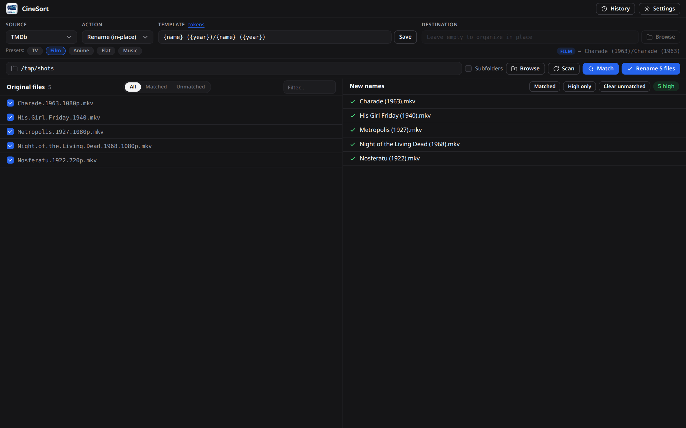
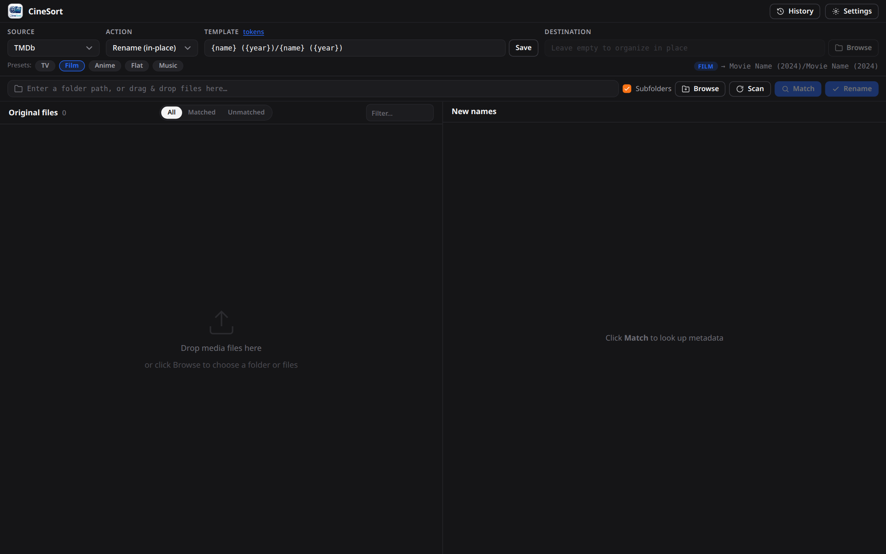
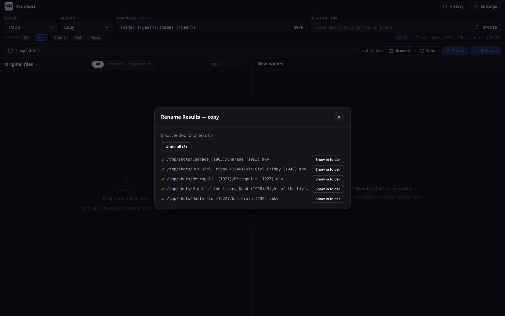
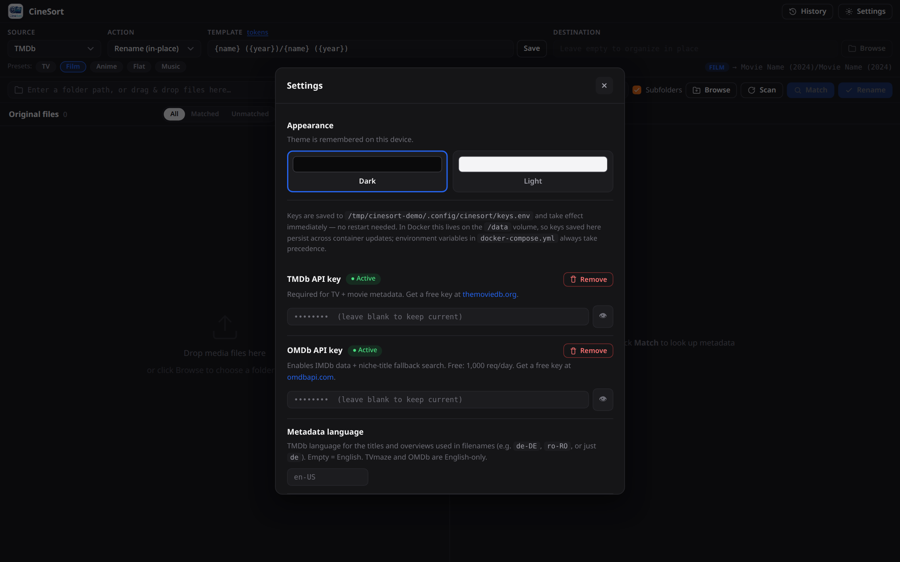

# CineSort

**Professional media file organizer with intelligent metadata matching**

CineSort automatically detects, matches, and renames your movies, TV shows, and music using metadata from TMDb, TVMaze, OMDb (IMDb), and MusicBrainz. Run it as a lightweight Docker container **or** install it as a native desktop app (`.deb` / `.rpm` / AppImage) with a modern web interface.


---

## Screenshots

**Scan, match, and review** — original files on the left, clean new names with per-file selection and confidence on the right:



**Landing page** — source, action, and naming template with live preview and one-click presets:



**Rename results** — every operation is confirmed and undoable from History:



**Settings** — API keys (stored masked), metadata language, dark and light themes:



*The example files shown are public-domain films. Metadata in the match view comes from the TMDb API.*

---

## Features

### Core
- **Smart Detection** — Automatically detects movies and TV shows from filenames (season, episode, year, quality tags, release group)
- **Folder-aware detection** — In Plex/Jellyfin/Sonarr layouts (`Show Name (Year)/Season NN/…`) the show name, year and season are read from the folders, so files named only `S01E01.mkv`, `E01.mkv` or `01.mkv` still match as episodes of the right series. A bare number is only an episode inside a season folder — `300.mkv` stays the film.
- **Multi-Source Metadata** — TMDb, TVMaze, and OMDb (IMDb), merged and ranked by confidence
- **Flexible Renaming** — Template-based naming with a **live preview** and a click-to-copy token reference in Settings, including flat in-place mode
- **Rename In-Place** — Rename files without moving them — works on NAS/SMB shares
- **Multiple Actions** — Rename, Move, Copy, Hard Link, Symlink, Dry-run (Test)

### Matching
- **Cascade scoring + breakdown** — Multi-metric confidence score (name, year, S×E, absolute) with `original_title` awareness; the **View metadata** dialog shows *why* a match was chosen
- **Confidence gate** — High / Review / Low tiers; matches below 40% are flagged **review** and are **not** auto-selected for renaming, so a weak guess can never rename a file by accident
- **Smart fallback search** — Retries with the year dropped, then progressively trimmed titles, so noisy filenames still match
- **Anime / absolute numbering** — Cumulative absolute episode numbers are computed and matched
- **Year disambiguation** — Auto-resolves same-named shows when the filename carries a year (skips an unnecessary prompt)
- **Manual rename** — FileBot-style inline edit when auto-match fails: double-click, F2, or right-click → Edit

### UI / UX
- **Modern flat UI, two themes** — **Dark** (default) and **Light**; switch in Settings → Appearance, remembered per device
- **Folder picker** — Native OS file/folder picker on desktop (reaches your whole filesystem); a rich in-app browser on Docker/web with a shortcuts sidebar, editable path + breadcrumb, type-ahead filter, "media only" toggle, cross-folder multi-select, and full keyboard navigation
- **Template builder** — Type `{tokens}` with a live preview of the resulting path; the full token reference (click-to-copy, with meanings) lives in Settings → Template tokens
- **Bulk selection** — One-click "Matched", "High only" (at/above the review threshold), and "Clear unmatched"
- **Inline conflict resolution** — Resolve duplicate/exists conflicts in place with **Skip** or **Rename → (2)**
- **Drag & Drop** — Drop files or folders anywhere onto the app window (deb/AppImage, Wayland-aware)
- **Start over** — Click the CineSort logo to clear the session and begin fresh
- **Row reordering** — Drag rows to manually remap files to matches
- **Per-file Removal** — DEL key or right-click → Remove
- **Show in folder** — Reveal the original file in your file manager (desktop)
- **Remembers your setup** — Source, action, template, and last folder persist between sessions
- **Rename History** — Full log with per-operation undo; native confirm dialogs replaced with themed ones
- **Accessible** — ARIA roles + visible keyboard focus rings on lists and controls
- **Settings Panel** — Enter API keys in-app; no terminal required for desktop installs

### Platform & reliability
- **Docker Native** — ~180 MB image, runs anywhere
- **Desktop App** — `.deb`, `.rpm`, and AppImage packages for Linux, x86_64 **and** arm64 (Electron shell)
- **Install updates without a terminal** — Double-clicking a downloaded package often dead-ends in the distro's app store ("Installed", no upgrade offered) — so CineSort installs it for you. After **Download update** (verified: size + sha256, GitHub hosts only), the button becomes **Install update**: deb/rpm are installed through your system's native authorization dialog (polkit) — you approve with your password, `apt`/`dnf` do the actual install; AppImages are replaced in place, no privileges needed. Then the familiar **Restart to finish** prompt completes the switch. Nothing ever installs without your explicit click + authorization.
- **Conflict-free launch** — Picks a free port automatically, so a stale/duplicate instance can never block startup
- **Reliable rendering on Linux** — Software compositing avoids the all-black-window issue seen on Wayland/Intel (override with `CINESORT_ENABLE_GPU=1`)
- **Always-fresh UI** — Static assets sent with `Cache-Control: no-cache`, so a rebuilt container never serves stale JavaScript
- **No launcher collisions** — The AppImage won't shadow a deb install's menu entry, and stages itself to a stable path
- **Secure** — Non-root container, 0600 key file, contextIsolation, no eval
- **NAS/SMB Ready** — Actionable error messages for network mount limitations

---

## Quick Start

### Docker (recommended for servers / NAS)

```bash
mkdir -p ~/cinesort && cd ~/cinesort
wget https://raw.githubusercontent.com/aiulian25/cinesort/main/docker-compose.yml
nano docker-compose.yml # Set your media paths and optional API keys
docker compose up -d
```

Open **http://localhost:8888** in your browser.

> **Multi-arch image — just pull, never build.** `aiulian25/cinesort:latest` is published as a multi-arch manifest covering **`linux/amd64`** and **`linux/arm64`**, so it runs out-of-the-box on x86 PCs/mini-PCs/servers **and** ARM devices (Synology DSM 7+, Raspberry Pi 4/5, Apple-silicon Docker). Docker automatically pulls the right architecture — no `--platform` flag and no local build required.

### Desktop (deb / rpm / AppImage — x86_64 and arm64)

Download the latest release from the [Releases page](https://github.com/aiulian25/cinesort/releases).
Every format ships for both **x86_64** (`amd64`/`x86_64`) and **arm64** (`arm64`/`aarch64` — Raspberry Pi 5, ARM laptops).

**Debian / Ubuntu:**
```bash
sudo dpkg -i cinesort_1.6.1_amd64.deb # arm64: cinesort_1.6.1_arm64.deb
cinesort # or launch from your application menu
```

**Fedora / RHEL / openSUSE:**
```bash
sudo dnf install ./cinesort-1.6.1.x86_64.rpm # arm64: cinesort-1.6.1.aarch64.rpm
cinesort
```

**AppImage (any distro):**
```bash
chmod +x CineSort-1.6.1.AppImage # arm64: CineSort-1.6.1-arm64.AppImage
./CineSort-1.6.1.AppImage
```
On first launch the app **automatically** installs itself into your application launcher (writes a `.desktop` entry and all icon sizes). No installer script needed — just double-click or right-click → Open.

> **arm64 note:** the bundled Python environment is compiled per build machine; on arm64 the app detects this on first launch and rebuilds a native environment automatically — **the first launch on arm64 needs an internet connection** (one-time, ~30 s).

---

## API Keys

### Which keys do you need?

| Source | Key required? | What it unlocks |
|--------|:---:|---|
| **TVMaze** | No | Free TV episode data, no limits |
| **TMDb** | Optional | Movies + TV; your own key unlocks full API access. |
| **OMDb** | Optional | IMDb data; automatically used as fallback when TMDb returns no results. Unlocks niche titles TMDb may miss. |

### Getting a TMDb key (free)

1. Create a free account at [themoviedb.org](https://www.themoviedb.org/signup)
2. Go to **Settings → API** → request a Developer key
3. Copy the **API Key (v3 auth)** string

### Getting an OMDb key (free)

1. Go to [omdbapi.com/apikey.aspx](https://www.omdbapi.com/apikey.aspx)
2. Choose the **FREE** tier (1,000 requests/day)
3. Submit the form — your key arrives by e-mail within minutes

---

## Adding API Keys

### Option A — In-app Settings (desktop installs, easiest)

Click the **Settings** button in the top-right of the app.

- Paste your key into the relevant field (the eye button toggles visibility)
- Click **Save & Apply**
- Keys take effect immediately — **no restart required**
- They are stored in `~/.config/cinesort/keys.env` with permissions `0600` (owner-read only) and survive app upgrades

### Option B — Docker Compose (server / NAS installs)

Uncomment and fill in the relevant lines in `docker-compose.yml`:

```yaml
environment:
  - PUID=1000
  - PGID=1000

  # TMDb — https://www.themoviedb.org/settings/api
  - TMDB_API_KEY=your_tmdb_api_key_here

  # OMDb — https://www.omdbapi.com/apikey.aspx
  - OMDB_API_KEY=your_omdb_api_key_here
```

Then restart:
```bash
docker compose up -d
```

> **Priority rule:** Environment variables always win over the `keys.env` file. If you set a key in `docker-compose.yml`, the in-app Settings panel will not overwrite it.

### Option C — Edit the config file manually (power users)

```bash
mkdir -p ~/.config/cinesort
nano ~/.config/cinesort/keys.env
```

```ini
# CineSort API keys
TMDB_API_KEY=your_tmdb_api_key_here
OMDB_API_KEY=your_omdb_api_key_here
```

```bash
chmod 600 ~/.config/cinesort/keys.env
```

Restart the app for changes to take effect when editing the file manually.

---

## Configuration Reference

### Environment Variables

| Variable | Default | Description |
|----------|---------|-------------|
| `PUID` | `1000` | User ID for file permissions — run `id -u` on your host |
| `PGID` | `1000` | Group ID for file permissions — run `id -g` on your host |
| `TMDB_API_KEY` | *(bundled)* | Custom TMDb v3 API key |
| `OMDB_API_KEY` | *(none)* | OMDb API key; OMDb is silently disabled without it |
| `TMDB_LANGUAGE` | *(none — English)* | TMDb metadata language for titles/overviews used in filenames (ISO code, e.g. `de-DE`, `ro-RO`). Also settable in the app Settings. TVmaze/OMDb are English-only. |
| `CINESORT_UPDATE_CHECK` | `1` | Set to `0` to disable update checks against the GitHub releases API — both the once-per-day automatic check and the Settings "Check for updates" button (the only non-metadata outbound request; nothing ever auto-installs) |
| `CINESORT_LOW_CONFIDENCE` | `0.4` | Matches at/below this score are never auto-selected for renaming (0–1) |
| `CINESORT_REVIEW_CONFIDENCE` | `0.6` | Matches below this score show the "needs review" marker and count toward "Review N matches" (0–1) |
| `CINESORT_CACHE_TTL` | `900` | Seconds that provider responses (searches, episode lists) are cached in memory — re-matching the same show costs zero requests within this window. `0` disables caching |
| `CINESORT_WATCH_INTERVAL` | `60` | Seconds between watch-folder checks (Settings → Watch folders). Minimum 2 |
| `CINESORT_HOST` | `0.0.0.0` | Server bind address |
| `CINESORT_PORT` | `8888` | Server port |
| `CINESORT_DATA_DIR` | `/data` (Docker image) | Where history (`history.json`) and UI-saved API keys (`config/keys.env`) live. The image points it at the `/data` volume so both survive container recreation. Unset on desktop builds (per-user home paths are used). |
| `CINESORT_BROWSE_ROOTS` | *(none)* | Extra folders the in-app browser may expose, in addition to `/mnt` and `/media` (`:`-separated, e.g. `/srv/tv:/srv/movies`). Only add paths you also mount. Shown as quick-access shortcuts. |
| `CINESORT_SCOPE_TO_BROWSE_ROOTS` | *(unset)* | Set to `1` to confine **scanning, rename destinations, and watch rules** to the same roots the in-app browser may expose (`/mnt`, `/media`, plus `CINESORT_BROWSE_ROOTS`) — paths outside them are refused (422/403). Off by default because the desktop builds' native picker is meant to reach `$HOME`. Recommended for any Docker instance whose port is published beyond `127.0.0.1`. |
| `CINESORT_ENABLE_GPU` | *(unset)* | Desktop only: set to `1` to re-enable GPU hardware acceleration (disabled by default on Linux to avoid black-window issues) |

### Volume Mounts

> **Reflink copy in Docker:** a reflink cannot cross filesystems, so the source and destination must be inside the *same* mounted volume — two separate `-v` mounts will fail even if both are btrfs on the host.

| Mount | Purpose |
|-------|---------|
| `/data` | Rename history and configuration (persist this!) |
| `/media` | Your media root — can be split into sub-mounts |
| `/mnt` | Alternative root — browse mounts directly |

**Examples:**

```yaml
# Single library
volumes:
  - cinesort-data:/data
  - /mnt/media:/media

# Multiple libraries
volumes:
  - cinesort-data:/data
  - /mnt/movies:/media/movies
  - /mnt/tv:/media/tv
  - /mnt/downloads:/media/downloads

# NFS/SMB network share
volumes:
  - cinesort-data:/data
  - /mnt/nas:/media:rw
```

---

## Usage Guide

### 1. Scan files

- Enter a folder path in the scan bar, or **drag & drop** files/folders anywhere onto the app window
- Click **Browse**:
  - **Desktop (deb/AppImage):** opens your native OS picker — choose folders or files anywhere on the machine
  - **Docker / web:** opens the in-app browser — shortcuts sidebar, editable path/breadcrumb, type-ahead filter, "media only" toggle, and checkbox multi-select that **persists across folders**; navigate with ↑/↓, Space to select, Enter to open, Backspace to go up
- Toggle **Subfolders** to include sub-folders
- Release samples (`*.sample.mkv`, anything under a `Sample/` folder) and media-server extras folders (`Extras`, `Featurettes`, `Behind The Scenes`, `Deleted Scenes`, `Trailers`, `Interviews`, `Scenes`, `Shorts`, `Other`) are **skipped by default** — a 60-second sample matches the same record as its feature and collides with it. The status line says how many were left out; tick **Samples & extras** to include them. Naming a sample directly, or scanning an extras folder itself, always returns it.
- Click **Scan**
- **Start over any time:** hover the CineSort logo/name in the top-left corner — a "Start over" hint appears; clicking it clears the file list, matches, and selections so you can begin a fresh session without removing files one by one

### 2. Match metadata

- Select a **Source** from the toolbar dropdown:
  - **TMDb** — best for mainstream movies and TV (default)
  - **TVMaze** — alternative TV source, completely free
  - **OMDb (IMDb)** — IMDb data; ideal for niche titles
- Audio files (`.mp3`, `.flac`, …) always match via **MusicBrainz** regardless of the selected Source — a mixed video + music batch matches in one click (music uses its own `{artist}/{album}/{track} - {title}` naming unless your template contains music tokens)
- Click **Match**
- If multiple shows are found you will be asked to choose one

### 3. Manual rename (when auto-match fails)

When a file shows **No match found** in the right pane:

- **Double-click** the row, or press **F2** with it focused, or **right-click → Edit name manually**
- Type the new filename stem (extension is preserved automatically)
- Press **Enter** to confirm or **Esc** to cancel
- The row gets an amber **manual** badge and the Rename button enables immediately

### 4. Choose a template

| Preset | Template | Use for |
|--------|----------|---------|
| **TV** | `{n}/Season {s}/{n} - {s00e00} - {t}` | Plex/Jellyfin TV libraries |
| **Film** (default) | `{n} ({y})/{n} ({y})` | Plex/Jellyfin movie libraries |
| **Anime** | `{n}/{n} - {absolute} - {t}` | Absolute-numbered anime |
| **Flat** | `{n} - {s00e00} - {t}` | Rename in-place, no folders |

Or build your own: type tokens directly — the **tokens** link beside the template field opens the full click-to-copy reference (Settings → Template tokens) — and a **live preview** shows the resulting path for the first file as you edit, naming any token it does not recognise instead of leaving it in the name.

<!-- tokens:start -->
| Token | Meaning | Example |
|---|---|---|
| **Every match** | | |
| `{n}` | Series or movie name | `Breaking Bad` |
| `{name}` | Series or movie name (same as {n}) | `Breaking Bad` |
| `{y}` | Year | `2008` |
| `{year}` | Year (same as {y}) | `2008` |
| `{t}` | Episode title, movie title, or track title | `Pilot` |
| `{title}` | Same as {t} | `Pilot` |
| `{id}` | Database id of the matched record (source-dependent) | `1396` |
| `{tmdbid}` | TMDb id — empty unless the match came from TMDb | `1396` |
| `{imdbid}` | IMDb id — films via OMDb/TMDb, series via TMDb/TVmaze | `tt0903747` |
| **TV series** | | |
| `{s}` | Season number | `1` |
| `{e}` | Episode number | `5` |
| `{s00}` | Season number, zero-padded | `01` |
| `{e00}` | Episode number, zero-padded | `05` |
| `{s00e00}` | S01E05 — range-aware for multi-episode files | `S01E05` |
| `{e_end}` | Last episode of a multi-episode file | `6` |
| `{absolute}` | Absolute episode number (anime) | `42` |
| `{d}` | Air date | `2008-01-20` |
| **Video files** | | |
| `{source}` | Release source | `WEB-DL` |
| `{vf}` | Video format / resolution | `1080p` |
| `{quality}` | Same as {vf} | `1080p` |
| `{group}` | Release group | `GROUP` |
| `{codec}` | Video codec | `x265` |
| `{audio}` | Audio codec | `DTS-HD` |
| **Movies** | | |
| `{edition}` | Edition tag — empty when none | `Extended` |
| `{part}` | Part number of a split release — empty when single | `2` |
| `{partN}` | " - Part 2" for a split release — empty otherwise | ` - Part 2` |
| `{collection}` | TMDb franchise name — empty when the film is standalone | `Iron Man Collection` |
| `{collectionN}` | Franchise name plus "/" — nests franchise films one folder deeper, standalone films unchanged | `Iron Man Collection/` |
| **Music** | | |
| `{artist}` | Track artist | `Radiohead` |
| `{album}` | Album title | `OK Computer` |
| `{track}` | Track number, zero-padded | `03` |
<!-- tokens:end -->

Empty tokens collapse cleanly — `{n} ({y}) [{edition}]` renders as `Movie (2010) [Extended]` for an extended cut and plain `Movie (2010)` otherwise, matching Jellyfin/Plex edition naming. The id tokens enable agent hints like `{n} ({y}) [imdbid-{imdbid}]`: `{tmdbid}` is set for TMDb matches, and `{imdbid}` is set for films matched via OMDb **and for series** (TMDb's external ids, or TVmaze's own — previously TV always rendered an empty hint). TVmaze's internal show ids still map to neither token; an empty id collapses the whole `[imdbid-…]` hint. `{id}` keeps its source-dependent value for existing templates.

### 5. Choose an action

| Action | Description |
|--------|-------------|
| **Rename (in-place)** | Renames the file in its current folder — works on SMB/NAS |
| **Test (Dry Run)** | Previews results without touching any files |
| **Move** | Moves files to new paths built from the template |
| **Copy** | Copies to new path, keeps originals |
| **Hard Link** | Same-filesystem hard link at the new path |
| **Symlink** | Symbolic link — not supported on SMB/FAT |

### Destination folder (optional)

Set **Destination** in the options card to build template paths under a target folder instead of next to each source file — the "sort my Downloads into my library" workflow: Destination `/mnt/media/TV`, template `{name}/Season {s}/…`, action **Move**. Leave it empty to organize in place (the default). Previews and conflict checks run against the real target, and Undo always returns files to their true origins.

- Not used by **Rename (in-place)** — that action never moves files, so the field is disabled while it's selected
- **Docker:** the destination must be inside a mounted volume, same rule as scanning (see Volume Mounts above)

### 6. Review and rename

- Check the confidence tier on each match — **High** (green), **Review** (amber, <60%), **Low** (red, <40%, auto-deselected)
- Use the bulk buttons in the New names header to quickly select **Matched**, **High only** (at/above the review threshold), or **Clear unmatched**
- Uncheck any rows you want to skip
- Click **Rename**
- If any **conflicts** are found (duplicate destination / file already exists), resolve them inline with **Skip** or **Rename → (2)**
- Results are shown immediately; failures include the reason
- All operations are recorded in **History** (top-right button) with per-operation **Undo**

### Music libraries

`Artist/Album (Year)/03 Title.flac` is the layout every ripper writes, and for most libraries the album name exists **only** in the folder. CineSort now reads it: the parent folder supplies the album (and its year), the grandparent the artist, and a bare `01 Title` / `01. Title` stem gives the track number. The artist also goes into the MusicBrainz query, which is the difference between the right recording and a random cover version.

A folder name that is a library root or a format bucket (`Music`, `Downloads`, `flac`, `Various Artists`…) is never taken as an artist or album.

MusicBrainz's answer still wins when it comes from a studio album — that spelling is canonical. When its top hit is a live set or a compilation that merely contains the track, your folder wins instead of being overwritten with `Unknown Album`.

**Album art travels with the tracks.** When a **Move** empties an album folder of audio, `cover.jpg` / `folder.jpg` / `front.jpg` move to the new album folder and are recorded in History, so **Undo** puts them back. Art stays put if any track stayed behind, if the action was a copy or a link, or if the destination already has its own.

### Subtitles without their video

A folder of `.srt` files — subtitles downloaded after the videos were already renamed and moved — now matches on its own. Previously every row read *"Subtitle skipped — companion video not in this batch"*, because subtitles were only ever renamed by copying a matched video's name.

When the video **is** in the batch, nothing changes: it still supplies the name, the score and its pinned flag, exactly as before. Only subtitles with no companion take the new path, and two videos claiming the same episode still refuse the subtitle rather than guess.

### Subtitle language tags

Subtitle suffixes are rewritten to the ISO-639-1 code Plex and Jellyfin index on, with flags after the language: `.eng` → `.en`, `.English` → `.en`, `.German` → `.de`, `.forced.eng` → `.en.forced`, `.hi`/`.cc` → `.sdh`. Previously `.English` was not recognised at all and the language was **lost** on rename.

Anything unrecognised is left exactly as it was — a region subtag like `.en-US`, an unknown word, or a bare `.hi` (Hindi or hearing-impaired? CineSort will not guess). A trailing word that is not a known language, such as `Show.S01E01.Pilot.srt`, is treated as part of the name and never moved.

### Film collections

The **Film (collections)** preset (`{collectionN}{name} ({year})/{name} ({year}){partN}`) nests franchise films under their TMDb collection folder and leaves standalone films exactly where they were:

```
Iron Man Collection/Iron Man (2008)/Iron Man (2008).mkv
Inception (2010)/Inception (2010).mkv
```

`{collection}` is the franchise name on its own; `{collectionN}` adds the trailing slash so one template serves both cases. The name is TMDb's verbatim, which is what Plex's collection agent matches on.

TMDb keeps a film's collection — and its IMDb id — on the full movie record rather than in search results, so reading either costs one extra request per film. CineSort fetches it **only when your template mentions `{collection}`, `{collectionN}` or `{imdbid}`**: the default preset pays nothing for tokens you never typed. A side effect worth knowing: `{imdbid}` now resolves for TMDb-matched films too, not just OMDb ones.

### Split (multi-part) movies

A film delivered as `Movie.2010.CD1.mkv` / `CD2.mkv` used to render one destination twice — one part was skipped, or renamed `Movie (2010) (2).mkv`, which no media server stacks back into a single entry. `CD1`, `Part1`, `pt2`, `Disc 1` and `Disk 2` are now detected and exposed as `{part}` / `{partN}`; the **Film** preset uses `{partN}`, so the parts land as `Movie (2010) - Part 1.mkv` and `- Part 2.mkv` and Plex/Jellyfin play them as one film. Single-file releases are unaffected — the token renders empty.

`Part` is only read as a part number when it follows the year: in `Harry.Potter.and.the.Deathly.Hallows.Part.1.2010.mkv` it belongs to the title, and CineSort leaves it there.

### Finding a title by IMDb ID

Search metadata accepts a `tt…` ID directly. It used to require an OMDb key to even start; now whichever provider you have answers — OMDb for the richest record, TMDb for films and shows, and **TVmaze with no key at all** for series. A keyless deployment can resolve a show by ID and rename its episodes.

### Tray mode (desktop)

Watch folders only run while CineSort is running, so on the desktop packages closing the window used to stop them — while the Docker image organizes 24/7. Settings → **Keep running in the tray when the window is closed** closes that gap: the window hides to a tray icon, the backend and its watch loop keep going, and the tray menu offers **Open CineSort**, the active watch count, **Pause watching** and **Quit**.

It is **off by default**. Turning it on means a local HTTP server on `127.0.0.1` stays alive after you close the window — the tray icon is there so that is never invisible, and **Quit** from the tray stops both the app and the backend.

**Pause watching** is a runtime pause: your saved rules are untouched, so a restart resumes watching. It never silently disables the rules you configured.

> **GNOME users:** GNOME has no built-in tray. Install the *AppIndicator and KStatusNotifierItem Support* extension to see the icon. The deb and rpm packages depend on `libayatana-appindicator3-1` / `libayatana-appindicator-gtk3`; for the AppImage, install the equivalent package for your distribution.

### Cancelling a long scan or match

A **Cancel** button appears in the status bar while a scan or match is running. It is needed most for music — MusicBrainz mandates one request per second, so a few hundred tracks is several minutes — and for a recursive scan pointed at the wrong folder on a NAS.

Cancelling a **match** keeps everything already matched; the files it never reached are listed as *"Cancelled before matching"* so nothing silently disappears from the list. Cancelling a **scan** discards the partial walk rather than presenting half a folder as the whole one.

Watch-folder runs are unaffected — they have their own progress state, so stopping an interactive job never quietly stops the background organizer.

### Reflink copy (btrfs / XFS / ZFS)

**Reflink copy** clones a file copy-on-write: instant, no extra disk space, and — unlike a hard link — the two files are **independent**, so editing one does not change the other. It is the "keep seeding the original, organize a copy into the library" workflow at zero cost.

It needs a filesystem that supports reflinks (btrfs, XFS with `reflink=1`, ZFS, APFS) **and** both files on the *same* filesystem. On ext4, SMB or exFAT it fails immediately with a message naming what to use instead — it never silently falls back to a full byte copy, because a user who chose it to avoid duplicating 40 GB would otherwise spend it without being told.

Available as a rename action and as a watch-rule action; **Undo** removes the clone, exactly like an ordinary copy.

### Fixing a whole season's episode numbers

Anime rips use absolute numbering (`Show - 105.mkv`) and some packs are numbered `E101`+ or start at `E00`, so an entire season lands on the wrong episode. Right-click any episode row → **Shift episode numbers…**, give an offset (and optionally a target season), and every file in that detection group is renumbered and re-matched in one step.

The dialog tells you the current range and suggests the offset that starts the group at E1. An offset that would produce episode 0 or lower is refused before anything changes.

### Quality upgrades

When a rename lands on a file you already have, CineSort now shows both sides — `existing 720p · BluRay · 1.4 GB → incoming 2160p · BluRay · 18.2 GB` — because it already knew them. Alongside **Rename → (2)** and **Skip** there is **Replace (upgrade)**, and a **Prefer higher quality** checkbox that applies it to every conflict where the incoming resolution is strictly higher.

**Replace never deletes.** The existing file is moved aside as `Movie (2010).replaced-20260906-143012.mkv` in the same folder, both moves are recorded in one history batch, and **Undo** restores the original layout exactly. If the replacement itself fails, the old file is put straight back.

The sweep compares **resolution only**. A 2160p re-encode can be smaller than a 1080p remux, so sizes are shown to you but never used to decide on your behalf.

### History as an audit trail

Every rename now records **what CineSort decided**, not just what it did: the matched title, season/episode or year, the provider and its id, the confidence score, and the template used. The History dialog shows it under each row — `Breaking Bad · S01E01 · tmdb 1396 · 0.97` — so "why is this file called that?" has an answer months later.

Two things follow from storing it:

- **Export CSV** writes every field, including the match reasoning, for spreadsheets or feeding another tool. The log keeps the last 1000 operations; the export is how you keep a permanent record.
- **Re-apply** re-renders a past rename under your *current* template — computed entirely from what was stored, so **no provider is contacted** and it works with no API keys at all. The rename itself goes through the normal path, so it is undoable like any other.

Entries written before this update have no stored reasoning; they still load, and Re-apply simply is not offered for them.

### Shared presets and options

The template, action, destination, subfolder/sample toggles and your **custom presets** are stored on the server (`prefs.json`, beside your watch rules) as well as in the browser. One CineSort instance therefore behaves like one app: presets built on the desktop are there on the laptop, and a fresh browser or a cleared cache inherits them instead of starting from defaults. On Docker they live on the `/data` volume and survive redeploys.

The browser copy is still written first, so the options card never waits on a request and keeps working if the backend is unreachable. **Theme and the last-scanned path stay on the device** — they describe where you are sitting, not how you organize your library.

Watch rules gain a **Preset…** dropdown that fills the template field. The rule still stores the resolved template, so editing a preset later never silently repoints a rule built from it.

### Matching & performance settings

Settings → **Matching & performance** exposes four knobs that were previously environment-variable-only, and therefore unreachable on the desktop packages (a `.desktop` launcher passes no environment):

| Setting | Meaning | Default |
|---|---|---|
| Weak-match warning | Rows below this score are flagged as weak for review | `0.4` |
| Auto-rename threshold | Watch folders never rename below this score | `0.6` |
| Watch interval | Seconds between watch-folder checks | `60` |
| Metadata cache | How long provider responses are reused; `0` disables | `900` |

Changes apply to the next match — no restart. Values are stored in `keys.env` alongside your API keys.

**Precedence is unchanged:** an environment variable still wins over the saved value on every restart, so a Docker admin's `docker-compose.yml` is never overridden by a click in the UI. When a knob is set that way the card says so, instead of showing a field that would silently not take effect.

### Remembered matches

When several shows or films share a title, CineSort asks once. The record you pick is remembered (`aliases.json`, beside your watch rules), so every later match of that title resolves to it silently — including watch-folder runs, which is what finally makes "match it once, then it stays automatic" true. Settings → **Remembered matches** lists them with a **Forget** button; forgetting one brings the prompt back.

Only picks *you* make are remembered — an automatic match never teaches itself, so a wrong guess can never become self-renewing.

### Watch folders (auto-organize)

Settings → **Watch folders** turns CineSort into a hands-off pipeline: define up to 10 rules — folder, metadata source, naming template, action (Move/Copy/Hard Link/Symlink/Move + Keep Link), optional destination — and every enabled folder is checked once a minute (`CINESORT_WATCH_INTERVAL` to tune). New media files are picked up only after their size has settled across two checks (a half-copied download never moves), matched headlessly, and renamed **only at high confidence** (at/above the review threshold). Every run is a normal history batch — undo it from History like any manual rename. The card shows each rule's recent activity.

Each rule carries its own intent. Behind **Advanced** on a rule: **Subfolders** (recurse or stay at the top level), **Media** (organize only TV, only movies, only music, or any combination), **Samples & extras** (off by default — see above), and **Min confidence** (leave blank to follow the app-wide review threshold, or demand more before this rule touches your library). The activity log names the threshold that held a file, so "nothing safe to organize" is never a mystery.

What is deliberately left in place, with the reason in the activity log:
- **Ambiguous titles** (several same-named shows) — match the show once manually; automation resumes after
- **Low-confidence and unmatched files** — nothing renames below the review threshold, ever
- **Docker:** watched folders and destinations must be mounted volumes; rules live on `/data` and survive container updates. **Desktop:** watches run while CineSort is open.

### Command line (headless)

The same scan → match → rename pipeline the UI drives, without a browser — for cron, systemd timers or a quick dry run over SSH.

```bash
python -m app.cli scan   ~/Downloads                       # what CineSort detects, no provider calls
python -m app.cli match  ~/Downloads --show-id 1396 --show-name "Breaking Bad"
python -m app.cli rename ~/Downloads --destination /media/TV --action move --yes
python -m app.cli watch  --once                            # run the saved watch rules one pass and exit
```

Useful flags: `--json` (machine-readable on stdout, notes on stderr — pipe straight into `jq`), `--action test` for a dry run, `--min-confidence`, `--template`, `--write-sidecars`, `--skip-conflicts`. Renames are recorded as normal history batches, so **Undo** in the UI works on them afterwards.

Exit codes: `0` all good · `1` error or aborted · `2` something unmatched or failed · `3` ambiguous (re-run with `--show-id` / `--movie-id`, which the output lists).

Renaming refuses to run unattended without `--yes` when stdin is not a terminal, so a cron job can never half-organize a library on a prompt nobody answered.

**Per install type:**

```bash
# Docker
docker exec cinesort python -m app.cli rename /media/incoming --yes --json

# deb / rpm (a shim is installed alongside the app)
cinesort-cli match ~/Downloads

# AppImage
./CineSort-1.6.1.AppImage --cli match ~/Downloads
```

`CINESORT_SCOPE_TO_BROWSE_ROOTS=1` confines the CLI to the same allow-list it confines the HTTP API to — it is not a way around that setting.

### Change the theme

Open ** Settings → Appearance** and pick **Dark** or **Light**. The choice applies instantly and is remembered on this device.

---

## Troubleshooting

### Drag & Drop not working (deb / AppImage)

The desktop packages apply `--no-sandbox` automatically and switch Electron to Wayland-native mode when `XDG_SESSION_TYPE=wayland`. If drag & drop still fails:

```bash
# Check which session type you are running
echo $XDG_SESSION_TYPE

# Run from terminal to see errors
/opt/CineSort/cinesort --no-sandbox
```

### Desktop app shows a black window (Linux)

As of v1.2.4 the desktop app uses software compositing on Linux, which fixes the all-black-window issue seen on some Wayland/Intel setups. If your GPU renders fine and you want hardware acceleration back, launch with:
```bash
CINESORT_ENABLE_GPU=1 /opt/CineSort/cinesort
```

### Desktop app won't launch from the app menu (spinner, then nothing)

Almost always a **stale `.desktop` entry** — e.g. you ran the AppImage once (it self-registers a launcher), then moved/deleted that AppImage, and its user-local entry now shadows the deb's and points at a missing file. Fix:
```bash
# Inspect what the menu entry runs:
gtk-launch cinesort
# Remove a stale user-local entry so the deb's entry is used:
rm -f ~/.local/share/applications/cinesort.desktop
update-desktop-database ~/.local/share/applications
```
v1.2.5+ AppImages detect an installed deb and no longer create a shadowing entry. (Running from a terminal — `/opt/CineSort/cinesort` — bypasses the menu entry and always works.)

### OMDb source is greyed out / returns nothing

OMDb requires a key. Click **Settings** and enter your key, or check that `OMDB_API_KEY` is set in `docker-compose.yml`.

### Permission denied when renaming

```bash
# Find your user/group IDs
id -u && id -g
```

Update `PUID`/`PGID` in `docker-compose.yml` and restart. For network mounts add `:rw`:
```yaml
- /mnt/nas:/media:rw
```

### Container won't start

```bash
docker logs cinesort
```

Common causes: port 8888 already in use; volume path does not exist; invalid `PUID`/`PGID`.

### Web UI unreachable

```bash
docker ps | grep cinesort # Is it running?
curl http://localhost:8888 # Does it respond?
docker inspect cinesort | grep Health
```

---

## API Sources

| Source | Free | Key | Rate limit | Notes |
|--------|:----:|:---:|-----------|-------|
| **TMDb** | | Optional | ~50 req/s | Mainstream movies & TV |
| **TVMaze** | | None | Reasonable use | TV only |
| **OMDb** | | Required | 1,000/day (free tier) | IMDb data |

This product uses the TMDB API but is not endorsed or certified by TMDB.

---

## Docker Compose Examples

### Minimal

```yaml
services:
  cinesort:
    image: aiulian25/cinesort:latest
    container_name: cinesort
    ports:
      - "8888:8888"
    environment:
      - PUID=1000
      - PGID=1000
    volumes:
      - cinesort-data:/data
      - /path/to/media:/media
    restart: unless-stopped

volumes:
  cinesort-data:
```

### Full (with API keys and resource limits)

```yaml
services:
  cinesort:
    image: aiulian25/cinesort:latest
    container_name: cinesort
    ports:
      - "8888:8888"
    environment:
      - PUID=1000
      - PGID=1000
      - TMDB_API_KEY=your_tmdb_api_key_here
      - OMDB_API_KEY=your_omdb_api_key_here
    volumes:
      - cinesort-data:/data
      - /mnt/movies:/media/movies
      - /mnt/tv:/media/tv
    restart: unless-stopped
    deploy:
      resources:
        limits:
          cpus: '2'
          memory: 1G
        reservations:
          memory: 256M
    logging:
      driver: "json-file"
      options:
        max-size: "10m"
        max-file: "3"

volumes:
  cinesort-data:
```

---

## Technical Details

| Item | Detail |
|------|--------|
| **Docker base** | Python 3.11 (Debian slim) |
| **Image size** | ~180 MB |
| **Docker architectures** | `linux/amd64` + `linux/arm64` (multi-arch manifest) |
| **Desktop architectures** | x86_64 + arm64 (deb, rpm, AppImage) |
| **Runtime** | FastAPI + Uvicorn |
| **RAM usage (Docker / server)** | ~150 MB — Python backend only; your browser renders the UI |
| **RAM usage (desktop app)** | ~600-800 MB — the Electron shell embeds Chromium to render the UI, plus the same Python backend. Typical for Electron apps; use the Docker/web version on memory-constrained machines |
| **Desktop shell** | Electron 35 |
| **User** | Non-root (UID configurable via PUID) |
| **Key storage** | `~/.config/cinesort/keys.env` — mode `0600` |
| **Health check** | `GET /` every 30 s |
| **API authentication** | **None** — see the note below |

> **Exposing the Docker port.** The API has no authentication, by design: it is
> built for a trusted machine or LAN, and the real boundary is the container
> user's own filesystem permissions (PUID/PGID plus whatever you mount).
> Anyone who can reach the port can browse and move files inside those mounts.
> Keep it bound to localhost (`127.0.0.1:8888:8888`) or a trusted network, put
> it behind your own reverse proxy and auth if it must be reachable, and set
> `CINESORT_SCOPE_TO_BROWSE_ROOTS=1` to confine scanning, rename destinations
> and watch rules to `/mnt`, `/media` and your `CINESORT_BROWSE_ROOTS` instead
> of everywhere the container user can reach.
>
> Desktop installs (deb/rpm/AppImage) bind to `127.0.0.1` on a private port and
> are unaffected.

---

## Building from Source

```bash
git clone https://github.com/aiulian25/cinesort.git
cd cinesort
docker build -t cinesort:latest .
docker compose -f docker-compose.dev.yml up -d
```

**Desktop build:**
```bash
npm install
npm run build # produces .deb, .rpm and AppImage (x64 + arm64) in dist/
```

The `.rpm` needs `rpmbuild` (`sudo apt install rpm`). On hosts with RPM 4.20 or newer (Ubuntu 26.04+, Fedora 41+), electron-builder's bundled fpm stages files where rpmbuild no longer looks and the rpm targets fail with `File not found: …/BUILDROOT/…`. Install a current fpm with `gem install --user-install fpm`; `npm run build` uses it automatically when it is present.

---

## Contributing

1. Fork the repository
2. Create a feature branch (`git checkout -b feature/my-feature`)
3. Commit your changes
4. Open a pull request

---

## License

MIT License — see [LICENSE](LICENSE) for details.

---

## Changelog

### v1.6.1

A packaging fix for the desktop app on Linux; nothing changes for Docker.

- **First launch no longer fails on Debian, Ubuntu and derivatives** without `python3-venv`. When the bundled Python environment doesn't match the system's Python, CineSort builds its own — which needs `ensurepip`, and Debian ships that separately from `python3`. Without it the setup failed and the dialog blamed the internet connection. The `.deb` now depends on `python3-venv` and the `.rpm` on `python3-pip`, so the package manager installs it.
- **A clear message when it's still missing** — the AppImage can't declare dependencies, so CineSort now checks before building the environment and names the exact package to install for your package manager (apt, dnf, zypper, pacman).
- **The manual recovery steps no longer install a broken combination.** They used to `pip install` packages by name, which could resolve pydantic 1 beside a FastAPI that needs pydantic 2 and then die at startup with `cannot import name 'TypeAdapter'`. They now install from the bundled, pinned `requirements.txt`, with resumable downloads for slow connections.
- **Bundled Python moves to 3.14.** Ubuntu 26.04, Fedora 42+ and Arch start instantly; on Ubuntu 24.04 and Debian 13 the installer rebuilds the environment for your Python once, which takes about 30 seconds and needs a network connection.

### v1.6.0

**Files that never matched before**

- **Folder-aware detection** — in Plex/Jellyfin/Sonarr layouts (`Show Name (Year)/Season NN/…`) the show, year and season are now read from the folders. Files named only `S01E01.mkv`, `E01.mkv` or `01.mkv` used to be grouped under the title "Season 01" — or, for `E01.mkv`, classified as a *movie* — and could never rename correctly. A bare number is still only an episode inside a season folder, so `300.mkv` stays the film.
- **Subtitles without their video** — a folder of `.srt` files downloaded after the videos were already renamed now matches on its own. Every row used to read "companion video not in this batch". When the video *is* present nothing changes: it still supplies the name and the score.
- **Split (multi-part) movies** — `CD1`/`CD2`, `Part1`, `pt2`, `Disc 1` are detected and exposed as `{part}` / `{partN}`; the **Film** preset renders them as `- Part 1` / `- Part 2` instead of colliding on one destination. "Part" is only read as a part number *after* the year, so *Harry Potter and the Deathly Hallows Part 1* keeps its title.
- **Music from the folder layout** — `Artist/Album (Year)/03 Title.flac` now yields the artist, album, track and year, which for most libraries exist nowhere else. The artist also reaches MusicBrainz, which is the difference between the right recording and a random cover version. Album art (`cover.jpg`, `folder.jpg`…) moves with the tracks and is restored by Undo.
- **Episode numbers you can fix in bulk** — anime absolute numbering and packs numbered `E101`+ put a whole season on the wrong episode. Right-click a row → **Shift episode numbers…**, give an offset and optional season, and the group is renumbered and re-matched in one step.

**Matches that stick**

- **Remembered matches** — the show or film you pick when asked is remembered, so the same title never asks again, and watch folders finally deliver the "match it once, then it stays automatic" they have always promised. Settings → **Remembered matches** lists them with a **Forget** button. Only picks *you* make are remembered — an automatic match never teaches itself.
- **A pick now outranks detection** — choosing a film for a file misdetected as a series (or the reverse) used to be discarded, which was exactly the case the override existed for.
- **`{imdbid}` works for series** — the Jellyfin/Plex agent hint `[imdbid-…]` rendered empty for every TV file. An IMDb ID also resolves through TVmaze now, so a deployment with no API keys at all can still find a show by ID.
- **`{collection}`** — a new **Film (collections)** preset groups franchise films under their TMDb collection folder and leaves standalone films where they are.

**Control over what happens**

- **Cancel a running scan or match** — a Cancel button in the status bar. Cancelling a match keeps everything already matched; the rest are listed as cancelled rather than vanishing.
- **Quality-aware conflicts** — when a rename lands on a file you already have, both sides are shown (`existing 720p · 1.4 GB → incoming 2160p · 18.2 GB`) with a **Replace (upgrade)** option. The existing file is moved aside as `.replaced-<timestamp>`, never deleted, and Undo restores it.
- **Samples and extras are skipped** — release samples and `Extras`/`Featurettes` folders no longer collide with the feature they belong to. A toggle includes them.
- **Per-rule watch settings** — each watch rule gets its own subfolder, media-type, samples and minimum-confidence settings behind **Advanced**.
- **Matching & performance settings** — the confidence thresholds, watch interval and metadata cache are editable in Settings. They were environment-variable-only, which the desktop packages have no way to set.
- **Tray mode (desktop)** — closing the window can now minimize to the tray so watch folders keep running, instead of stopping the moment you close it. Off by default.

**Metadata that travels with your files**

- **`.nfo` + poster sidecars** — optionally write Kodi/Jellyfin metadata and poster art beside each renamed file, so the ids CineSort matched are the ids your media server uses.
- **Subtitle language tags are normalized** — `.eng` and `.English` both become `.en`, with flags after the language (`.en.forced`). `.English` was previously not recognised at all and the language was lost on rename.
- **History remembers why** — each entry records the matched title, provider and id, confidence and template. Export the whole log as CSV, or **Re-apply** a past match under a new template without contacting any provider.

**Everything else**

- **A command line** — `python -m app.cli scan|match|rename|watch` for cron and SSH, on every install type (`cinesort-cli` on deb/rpm, `--cli` for the AppImage, `docker exec` for Docker).
- **Shared presets and options** — templates, options and custom presets are stored on the server as well as the browser, so one CineSort instance behaves like one app across every device pointing at it.
- **Reflink copy** — an instant, space-free, *independent* copy on btrfs/XFS/ZFS.
- **Long shows match ~4× faster** — season fetches now run concurrently (a 39-season show went from 4.4 s to 1.2 s).
- **One version number** — the version lived in five hand-edited places and two had already drifted; MusicBrainz was being told this was CineSort 1.4.2. A test now fails if they disagree.
- **A complete token reference** — every `{token}` in one table, served to the UI and the README from the same source. Seven working tokens were undocumented, and the **Anime** preset's `{absolute}` silently rendered as nothing on rename while the live preview claimed otherwise.

### v1.5.1
- **Picking a show by IMDb ID no longer fails silently** — selecting the right title (by IMDb ID or from the "which one is it?" dialog) could leave every file unmatched with nothing on screen to explain it. The backend was erroring out: TMDb returns a show's year as text while everything else uses a number, and comparing the two crashed the whole request, so all files failed at once — not just the one being matched. Selecting a show now works, and a stray value from a provider can no longer take down an entire match.
- **The year is no longer part of the show name it searches for** — a file like `Lucky.2026.S01E01.mkv` was searched as "Lucky 2026", which fuzzy-matched a *different* series ("Lucky Luke") and, returning a single result, skipped the "which one is it?" prompt entirely. The year is now used as a filter instead of being part of the title, so the right show is found and genuinely ambiguous names ask you to choose.
- **Films named after a number keep their names** — "1917", "2012" and "2046" were losing their titles completely (the number was read as the release year, leaving nothing behind), and "Blade Runner 2049" lost both its "2049" and its real year. A number is now only treated as the year when it plausibly is one and something is left of the title.

### v1.5.0
- **Match a show or film by its IMDb ID** — pasting a `tt…` ID into Search metadata now works for **series**, not just films. It never could before: IMDb data alone carries no episode list, so a series ID had nowhere to go and the pick was silently dropped. CineSort now translates the ID to the matching TMDb show and runs the normal episode match, so a file named nothing but `tt0903747.mkv` becomes `Breaking Bad - S01E01 - Pilot.mkv`. Needs a TMDb key; without one it says so instead of failing quietly.
- **A match you pick by hand is now honored, and stays** — choosing an exact title (by IMDb ID, or from the "which one is it?" dialog) used to be refused outright when the filename resembled nothing, and even when it worked, the next **Match** click silently unticked the row so Rename skipped it. Your choice is now treated as a decision rather than a guess: it always applies, keeps its tick through later matching, and shows as high-confidence. The honest score is still there in **View metadata**, so "why this match" never lies to you.
- **Naming a file by hand ticks it for renaming** — pressing F2 (or the pencil) on a file the confidence gate had unticked left it unticked, so "Manual name set: …" was followed by a Rename that ignored it. Typing a name now counts as consent; cancelling still doesn't.
- **Fewer wrong matches on long, noisy filenames** — release tags the detector never removed (`Hybrid`, `REMUX`, `HDR10Plus`, `GERMAN.DL`, `VOSTFR`, a trailing `-GROUP`) were being sent to the metadata providers as part of the title. That diluted the score enough to skip the "1987 or 2026?" prompt on remakes and to push good matches under the auto-select threshold. Those tags are now stripped — and carefully: *The Italian Job*, *The French Connection*, *Spider-Man* and *Ant-Man* keep every word of their titles.
- **Long titles no longer fail at the last step** — a name longer than the filesystem allows previously passed matching, passed **Test (Dry Run) reporting success**, then failed the real rename with a raw `[Errno 36]`. Names are now trimmed to fit when they are built, so the preview shows what will actually be written. The limit is counted in bytes, so Japanese, Chinese and Cyrillic titles are handled correctly, and subtitles that inherit a video's name are trimmed alongside it. If an over-long name still reaches the filesystem, the error says so in plain words.
- **History records missing files** — a rename that failed because the source had vanished was the one failure the history never logged. It now appears like every other outcome (and, correctly, can't be undone).
- **Optional path confinement for servers** — new `CINESORT_SCOPE_TO_BROWSE_ROOTS=1` limits scanning, rename destinations and watch rules to your mounted roots (`/mnt`, `/media`, plus `CINESORT_BROWSE_ROOTS`) instead of everywhere the container user can reach. Off by default and unused by desktop installs; recommended for any Docker instance whose port is published beyond `127.0.0.1`. The README now spells out that the API has no authentication.
- **A test suite** — 59 regression tests covering detection, path building and the manual-match flows. The repo had none; every bug fixed in this release would have been caught by one.

### v1.4.3
- **Drag & drop actually works now** — v1.4.2 moved desktop builds to the native Wayland backend, but the bundled Chromium was older than Chromium's Wayland drag-and-drop rewrite: it read the drag data on the UI thread through several compositor roundtrips *before* telling the page a drag had entered, so the drop zone lit up seconds late and a normal-speed drop was discarded with no error. The desktop runtime is now current (Electron 43), which carries that rewrite — dropping files and folders from Nautilus, Dolphin, Nemo or Thunar registers immediately and lands every time. X11 sessions and the `CINESORT_OZONE` escape hatch are unchanged, and this also brings a year and a half of upstream security fixes.
- **A drop that can't be read now says so** — if the desktop ever hands over a drop with nothing readable in it, you get "Couldn't read the dropped files — try again, or use Add Files" instead of silence that looks like a frozen app. CineSort also recovers the files from a second source the browser engine sometimes uses, so fewer drops fail in the first place.
- **The window opens straight away** — CineSort used to start its backend first and only then draw anything, so a launch looked like nothing had happened for several seconds. The window now appears immediately with a "Starting CineSort…" splash and switches to the app the moment the backend is ready.
- **Faster launches after the first** — the startup check that verifies the bundled Python environment is now remembered between launches (re-run automatically after an update, or if the interpreter changes), removing a duplicate cost from every start.
- **AppImage: no more unpacking on every launch** — the menu entry CineSort installs for itself forced the AppImage to extract its full 125 MB to `/tmp` each time, a workaround only needed on systems without libfuse2 (Ubuntu 22.04+). It's now applied only where it's genuinely required, so systems that can mount the image start much faster. The entry is refreshed on each launch, so installing or removing libfuse2 corrects itself.

### v1.4.2
- **Wayland drag-and-drop fixed** — on a Wayland desktop session, dropping files from the file manager did nothing: the app ran under XWayland, and the compositor silently discarded the cross-protocol drag before it ever reached the window. Desktop builds now use the native Wayland backend when the session is Wayland (X11 sessions are unchanged). Escape hatch: `CINESORT_OZONE=x11` forces the old behavior.
- **Remove saved API keys** — each key stored on this machine now shows a **Remove** button beside its status in Settings, so a key can be deleted and replaced (blank = keep, type = change, Remove = delete). Keys provided by the environment (Docker compose) show a note instead — manage those where they're set. Fixes a latent issue where a saved key could only be overwritten, never cleared.
- **Deleting files fully clears them** — removing files from the list (context menu, Delete key) now also clears the template-preview sample, so a deleted title no longer lingers in the preview until "Start Over".
- **Browseable destination** — the Destination field has a **Browse** button to pick a target folder instead of typing a path (leave empty to organize in place).
- **Rename moved up** — the Rename button now sits beside Match at the top; the footer and the per-action explanatory line are gone, freeing vertical space.
- **Copy any text** — filenames and results are now selectable with the mouse and copyable with Ctrl/Cmd+C, even though rows stay draggable.
- **Clearer presets** — the live preview badges which preset/kind is active (Film vs TV, etc.), so the output format is unambiguous before you rename.
- **Adult content toggle removed** — matching is unrestricted; no toggle to tick.

### v1.4.1
- **Compact interface** — the chrome above the file list shrank from 335 px to ~217 px (controls 36→28 px, rows 42→30 px, tighter type and spacing): roughly **twice the files on screen** at every window size. The Insert-token palette moved to a click-to-copy **Template tokens** reference in Settings (now also documenting the music tokens); a small **tokens** link beside the template field opens it. Presets and the live preview share one row.
- **Native desktop layout** — on deb/rpm/AppImage the app now runs edge-to-edge inside its window with hairline separators, instead of web-page cards floating in a gutter ("border within a border"). Docker/browser keeps the card look — a browser tab provides no frame of its own.
- **Check for updates button** — the Settings update card can check on demand instead of waiting out the once-per-day window. Outcomes are honest: update found, up to date ("Checked just now"), or couldn't reach GitHub. A 30 s floor prevents API hammering, and deployments with `CINESORT_UPDATE_CHECK=0` stay fully offline — the button says so rather than sneaking a request.
- README screenshots recaptured on the new interface.

### v1.4.0
- **Watch folders (auto-organize)** — Settings → Watch folders turns CineSort into a hands-off pipeline: up to 10 rules (folder, source, template, action, destination), checked once a minute (`CINESORT_WATCH_INTERVAL`). Files are picked up only after their size settles (half-copied downloads never move), matched headlessly, and renamed **only at high confidence** — every run is a normal, undoable history batch. Ambiguous titles and low-confidence files stay in place, with the reason in the card's activity log. Rules live on `/data` in Docker and survive container updates.
- **Destination folder** — an optional Destination in the options card roots template paths under a target library instead of next to each file ("sort Downloads into `/mnt/media/TV`"). Previews and conflict checks run against the real target; Undo returns files to their true origins. Disabled under Rename (in-place), which never moves files.
- **Movies: remake disambiguation + id-accurate manual matching** — a no-year file whose candidates include same-titled remakes ("The Thing" 1982/2011) now prompts like series do, and manual picks (dialog or Search metadata) re-match through the backend by exact id — `{tmdbid}`/`{imdbid}`, year, poster and the real score breakdown all come out right. An explicit pick stays selected.
- **Mixed batches match in one click** — audio files always route to MusicBrainz whatever Source is selected; video follows the dropdown. Music keeps its own naming unless your template carries music tokens.
- **Smarter subtitles** — a subtitle from a different release (`show.s01e05.WEBRip.en.srt` beside your BluRay file) now pairs by detected season/episode when stems differ; quality-double ambiguity is refused honestly. Language tags are preserved as before.
- **TVmaze specials** — `SP01`-style files now match TVmaze specials (season 0, air order), same convention as TMDb.
- **Multi-episode titles** — `Show.S01E01-E02.mkv` renders both titles (`… - Rose & The End of the World`), capped at three (`A, B & N more`).
- **Move cleans up after itself** — a Move batch removes the source folders it emptied (`rmdir`-only, never touches folders still holding anything); undo recreates them. Watched folders are never removed.
- **Scan progress** — big NAS scans show live counts (`Scanning… 1,240 items · 312 media files`) instead of an indefinite bar.
- **Richer View metadata** — poster thumbnail and episode synopsis / movie plot, fetched from data the providers already sent.
- **Undo all from Rename Results** — revert the whole batch right where you see it, no trip to History.
- **Actionable History rows** — Show in folder (desktop) / Copy path per entry, Copy error on failures; full paths on hover.
- **Keep largest** — one-click duplicate triage in the conflicts dialog keeps the biggest copy selected and skips the rest.
- **Type-to-filter the panes** — find one file in an 800-row batch; visibility only, selection untouched.
- **Custom template presets** — save the current template under a name; presets persist like every other preference, right-click to remove.
- **Bulk-selection buttons restored** — Matched / High only / Clear unmatched are back in the New names header (the README promised them; now they exist).
- **Overlap-proof scanning** — dropping a folder plus files inside it lists each real file once (symlink twins collapse too); dropped folders honor the subfolder toggle.
- **Docker honors `CINESORT_PORT`/`CINESORT_HOST`** — the documented env vars now actually bind the server and the healthcheck follows.
- **Fixes** — the right-click menu works for filenames with apostrophes (`Ocean's Eleven.mkv`); stale README claims (Aurora theme, ≥60% wording) corrected.

### v1.3.8
- **Redesigned update experience** — a quiet dismissible banner announces new releases in the main window (once per version); Settings gains a proper **Software update** card with a real progress bar and byte counts, verification status, and honest error states; and the restart prompt is now an in-app CineSort-themed dialog whose button says **Restart CineSort** — no more OS-looking popup that read like a system reboot. Same two-click flow and identical security model (GitHub-only, sha256-verified, polkit-authorized) underneath.

### v1.3.7
- **Provider response cache** — searches and episode lists are cached in memory for 15 minutes, so re-matching the same show (or clicking through a disambiguation) costs zero repeat requests. Tune or disable with `CINESORT_CACHE_TTL` (seconds, `0` = off); cleared automatically when you change keys or language in Settings.
- **Non-blocking rename with live progress** — renames run off the main loop, so copying huge files no longer freezes the UI (or Docker's healthcheck); the status bar shows `Renaming 3/12: file…` with a real progress bar.
- **Series sources back each other up** — when TMDb finds no show, TVmaze is tried automatically (and vice versa) before reporting "No results"; View metadata shows which provider supplied the match, e.g. `Metadata source: TVMAZE (fallback)`.
- **Air-date matching tolerates ±1 day** — daily-show files stamped with the local broadcast date now match the adjacent provider air date at score 0.9 (exact dates still score higher).
- **Smarter music matching** — MusicBrainz queries prefer official studio-album recordings (no more live-bootleg albums for `Nirvana - Lithium`), results blend MusicBrainz's own relevance with filename similarity, and music matches now show the same "Why this match" breakdown as video.
- **New template tokens** — `{codec}` (x265), `{audio}` (DTS-HD), `{edition}` (Extended) and Jellyfin/Plex agent hints `{tmdbid}`/`{imdbid}` (`{n} ({y}) [imdbid-{imdbid}]`); empty tokens collapse cleanly, so files without an edition or id never get dangling `[]` brackets.
- **Undo cleans up after itself** — undoing a move/copy also removes the now-empty folders the rename created (never touches folders that still contain anything).
- **Actionable rename results** — every result row gets a button: Show in folder (desktop), Copy path (Docker/browser), Copy error on failures.
- **Richer show disambiguation** — the "multiple shows found" dialog shows status and genre chips (`Ended · Drama`), the fields that actually distinguish same-named reboots.
- **Desktop resilience** — a failed startup now shows the backend's own error log with one-click copy (instead of silently vanishing), and a backend crash mid-session restarts transparently once, with a Relaunch/Quit dialog if it keeps dying.

### v1.3.6
- **Resilient metadata fetches** — TMDb, TVmaze, and OMDb requests now retry exactly once on a rate limit (HTTP 429, honoring the provider's `Retry-After`, capped at 5 s) or a network timeout, so one transient blip no longer fails a whole match group. Real errors (revoked key, not found) still fail fast and are reported exactly as before. MusicBrainz is deliberately excluded — its client already rate-limits itself to 1 request/s per MusicBrainz policy.

### v1.3.5
- **Install updates without a terminal (desktop)** — after **Download update**, the button becomes **Install update**: deb/rpm are installed through your system's native authorization dialog (polkit) — you approve with your password, `apt`/`dnf`/`zypper` do the actual install; AppImages are replaced in place, no privileges needed. The downloaded file is re-verified (size + sha256) immediately before install, and the app never runs as root itself. If authorization is cancelled, nothing changes and you can retry; if polkit is unavailable, the verified file + install command are provided as before.
- **Restart to finish (desktop)** — after a deb/rpm upgrade lands (via the new Install button *or* a manual package install), the running app notices the new version on disk and offers "Restart now" to switch over; AppImage installs offer an instant handover to the new version.

### v1.3.4
- **One-click update download (desktop)** — the update notice in Settings is now a button that downloads the correct package for your install (deb/rpm/AppImage, x86_64/arm64 — auto-detected) to your Downloads folder with live progress, verifies its size **and sha256 checksum** against the GitHub release, makes AppImages executable, opens your file manager on the file, and shows the exact install command. Downloads are restricted to GitHub hosts; nothing auto-installs.
- **Releases on GitHub link** — the Settings footer always links to the releases page (up-to-date or not, on every platform) for release notes and manual downloads.

### v1.3.3
- **Configurable confidence gates** — the review (0.6) and auto-select (0.4) thresholds now live in the backend only and are served to the UI at startup, so all build targets share one source of truth. Override per deployment with `CINESORT_REVIEW_CONFIDENCE` / `CINESORT_LOW_CONFIDENCE` (0-1, clamped) — e.g. demand 0.8+ confidence before anything counts as a safe match.

### v1.3.2
- **Version & update notice** — Settings now shows the running version and, when a newer release exists, an update link (desktop) or the `docker compose pull` command (Docker). One GitHub check per day, 3-second timeout, disable with `CINESORT_UPDATE_CHECK=0`; nothing ever auto-installs.
- **Truthful season failures** — when an episode list or a single season can't be downloaded (network blip, provider error), affected files now say exactly that (`Season 3 could not be loaded from tmdb (…)`) instead of the misleading "No episode match"; they are also excluded from cross-season guessing at junk scores. API keys stay redacted in every error.
- **Natural sorting** — scan results list in human order (`E2` before `E10`, `Season 2` before `Season 10`) while keeping files grouped by folder.
- **Music preset live preview** — the template preview now renders real artist/album/track/title values for audio files instead of empty tokens.
- **Start over fix** — clicking the logo now also forgets the remembered scan path, so it no longer reappears after a page refresh or app restart.
- Removed two leftover debug prints from movie matching.

### v1.3.1
- **Start over** — the CineSort logo/name is now a reset button: hover reveals a "Start over" hint; clicking clears the file list, matches, and selections in one go (no more removing files one by one). In-flight scans/matches can't repopulate a cleared session.
- **Drag & drop fixed and widened** — drops are now accepted **anywhere in the app window**, and dropping new files while results are on screen no longer gets silently swallowed by the row-reorder handlers (the "takes a couple of tries" bug). Cancelled drags no longer leave a stuck highlight; drops are ignored while a modal is open.
- **Film is the default template** on fresh installs (previously TV); your saved template still wins.
- **README screenshots** — dark-theme captures of the real app (public-domain example files, masked keys) plus the TMDB attribution required by their API terms.

### v1.3.0
- **Complete UI redesign** — flat, modern interface (glassmorphism and animated backgrounds removed): app bar with logo tile, options card with friendly template tokens (`{name}`, `{year}`, `{title}`, `{quality}` — old short tokens still work), footer action bar with live "N of M files ready", All/Matched/Unmatched view filter, and per-row status icons. Themes reduced to **Dark** and **Light**.
- **Music renaming** — audio files (`.mp3`, `.flac`, …) now scan, match against **MusicBrainz** (keyless, rate-limit-respecting), and rename with the `{artist}/{album}/{track} - {title}` template. New Music source + preset.
- **Manual metadata search** — right-click any result row → *Search metadata…* to fix a wrong/failed match by title, year, or exact IMDb ID; series picks re-match the whole group.
- **Air-date matching** — daily shows named `Show.2024.03.05.mkv` now match the episode that aired that day (previously never matched).
- **Move + Keep Link action** — moves the file and leaves a symlink behind (seedbox-friendly); the action list is now served by the backend so it can't drift from the UI.
- **Smarter undo** — copy/hardlink/symlink operations are now undoable (destination removed, data-loss guarded), moves undo across filesystems, and History groups each Rename click into a batch with **Undo all**; "Show all history" reveals the full retained log.
- **Docker persistence** — rename history *and* keys/language saved from Settings now live on the `/data` volume and survive container updates (`CINESORT_DATA_DIR`).
- **Honest failures** — every unmatched row explains *why* (source error incl. invalid API key, no results, orphan subtitle, undetectable name); API keys are redacted from all error output.
- **Real match progress** — the status bar shows "Matching group 3/7: The Wire (25 files)…" with a filling bar instead of a fake timer.
- **TMDb metadata language** — new Settings field / `TMDB_LANGUAGE` env for localized titles in filenames (e.g. `de-DE`, `ro-RO`).
- **New packages** — `.rpm` (Fedora/RHEL/openSUSE) and **arm64** builds of deb/rpm/AppImage; packages now declare the `python3` dependency and the installer's Python detection is future-proof (works with Python 3.14+).
- **Performance/stability** — folder scans no longer block the server (a slow NAS scan froze every request); browse-dialog folder clicks navigate instead of silently selecting entire trees; "Include subfolders" is honored for browse selections.

### v1.2.6
- **Multi-arch Docker image** — `aiulian25/cinesort` is now published as a `linux/amd64` + `linux/arm64` manifest, so Synology/ARM users can pull and run it directly (no local build, no `--platform`).
- **File size on every result row** — after Match, each row in the New Names pane shows its file size (matched *and* unmatched), so you can compare duplicates and keep the right copy.
- **Go-to-top button** — appears once the file list is scrolled; jumps both panes back to the top.
- **Fix:** the toolbar **Scan** button now works when clicked (previously only Enter-in-path or Browse triggered a scan).

### v1.2.5
- **AppImage no longer shadows a deb install** — when a system (deb) install is detected, the AppImage skips self-registering its menu entry (and removes any stale one it left before), fixing "won't launch from the menu". It also stages itself to `~/.local/bin/CineSort.AppImage` so moving/deleting the downloaded file doesn't break the launcher.

### v1.2.4
- **Conflict-free launch** — the desktop app now resolves a free port at startup instead of hardcoding one, so a leftover/duplicate instance can no longer cause "fails to launch" (`address already in use`).

### v1.2.3
- **Black-window fix (Linux)** — disables GPU compositing by default on Linux (Wayland/Intel and others rendered an all-black window). Override with `CINESORT_ENABLE_GPU=1`.
- **Browse opens at a real root** — the in-app browser now opens at the first existing mounted volume (e.g. `/media`) instead of a hardcoded `/mnt` that may not exist in your container.
- **Always-fresh assets** — `Cache-Control: no-cache` on the web UI so a rebuilt container never serves stale JavaScript (one hard refresh needed the first time).

### v1.2.2
- **Three themes** — added **Light** and **Aurora** (neon-glass) alongside Dark, with a live theme picker in Settings → Appearance (remembered per device).
- **Fixed non-working modal buttons** — Cancel / Close / Done in Settings, History, and dialogs now work (they were broken by a scope bug).
- **Themed confirm dialogs** — replaced the off-theme native `confirm()` popups (Clear History, Undo) with in-app themed dialogs.
- **Consistent dropdown colours** — the Source `<select>` menu now matches the theme.

### v1.2.1
- **Better folder & file selection** — native OS picker on deb/AppImage; the in-app browser gained a shortcuts sidebar, editable path + breadcrumb, type-ahead filter, "media only" toggle, selection that persists across folders, and keyboard navigation. New `CINESORT_BROWSE_ROOTS` env var for extra browsable roots.
- **Better matching** — confidence gate (low-confidence matches flagged "review" and not auto-selected) with a three-tier colour legend; per-metric **match breakdown** in View metadata; fallback search queries; cross-source movie merge; O(1) exact-episode matching; real absolute (anime) numbering; year-based show disambiguation.
- **UI polish** — template token palette + live preview; bulk select (Matched / ≥60% / Clear unmatched); inline conflict resolution (Skip / Rename → (2)); "Show in folder" on desktop; remembers last-used source/action/template/folder; accessibility roles + focus rings; elapsed-time indicator during long matches.

### v1.2.0
- **OMDb / IMDb source** — third metadata source backed by IMDb data; falls back automatically when TMDb returns no results. Requires a free API key (1,000 req/day).
- **Adult-title support** — Adult checkbox in the toolbar passes `include_adult=true` to TMDb; OMDb never filters.
- **In-app Settings panel** — gear button opens a modal to enter/update API keys without touching a terminal or config file. Keys are saved to `~/.config/cinesort/keys.env` (mode 0600) and take effect immediately.
- **Manual rename (FileBot-style)** — When auto-match fails, double-click a row (or press F2, or right-click → Edit name manually) to type a custom filename. Extension is preserved automatically. Amber **manual** badge distinguishes manual entries from auto-matches. Right-click → Clear to revert.
- **Drag & Drop fixed on deb / AppImage** — Electron sandbox is now configured programmatically (`--no-sandbox` flag + `chrome-sandbox` setuid) so DnD works without manual desktop-entry patching. Wayland sessions automatically switch to ozone/Wayland mode so file managers (Nautilus, Dolphin) can hand paths to the app.
- **Improved movie scoring** — Uses `cascade_score` (year bonus/penalty, `original_title` comparison) instead of plain string similarity; score is capped at 1.0.
- **Keyboard shortcut** — F2 opens inline edit for the focused row; Delete/Ctrl+A are blocked during text input.
- **Duplicate function bug** — Removed a silently duplicated `showSelectionDialog` declaration.

### v1.1.0
- Rename In-Place action
- Per-file removal (DEL key / right-click)
- Action hint banner
- Flat template preset
- Improved SMB error handling

### v1.0.0
- Initial public release

---

## Acknowledgments

- **TMDb** — Movie and TV metadata (https://www.themoviedb.org/)
- **TVMaze** — TV show information (https://www.tvmaze.com/)
- **OMDb** — IMDb data API (https://www.omdbapi.com/)
- **FastAPI** — Modern Python web framework
- **Electron** — Cross-platform desktop shell
- **Docker** — Containerization platform

---

## Support

- **Issues**: [GitHub Issues](https://github.com/aiulian25/cinesort/issues)
- **Docker Hub**: [aiulian25/cinesort](https://hub.docker.com/r/aiulian25/cinesort)

---

**Made with for media enthusiasts**
